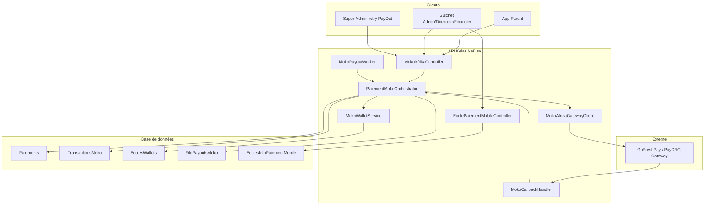
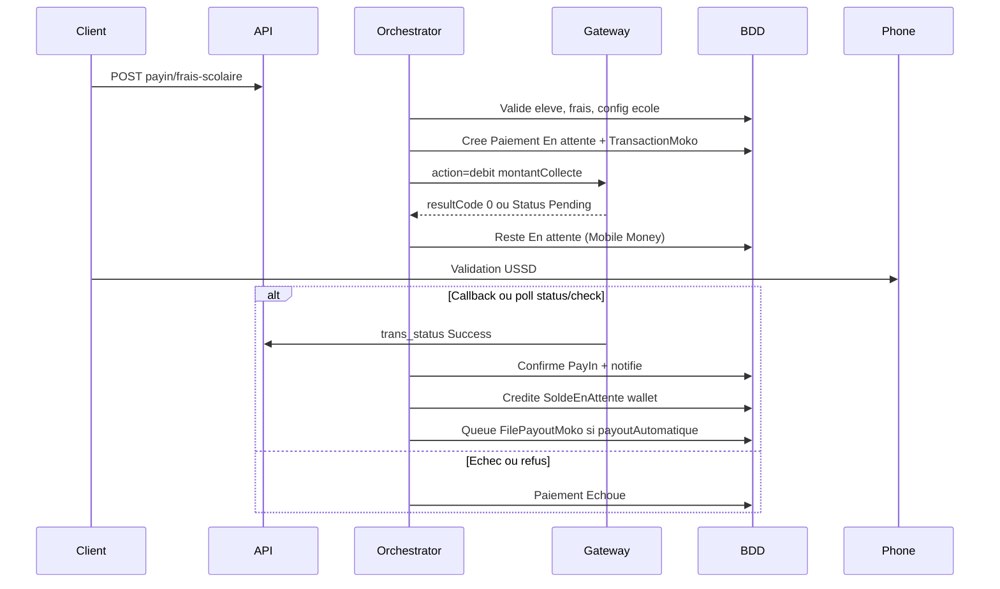

# Analyse — Paiement électronique MokoAfrika (implémenté)

État des lieux de l'intégration paiement Mobile Money / carte via **MOKO Afrika** (GoFreshPay / PayDRC) dans KelasiNaBisoAPI.

**Documents connexes :**

- Intégration frontend : [DOCUMENTATION_FRONTEND_PAIEMENT_MOKO.md](DOCUMENTATION_FRONTEND_PAIEMENT_MOKO.md)
- Spec gateway tiers : [integration-moko-afrika-projet-tiers.md](integration-moko-afrika-projet-tiers.md)
- Déploiement dev : [DEPLOIEMENT_DEV_KNB.md](DEPLOIEMENT_DEV_KNB.md)
- Changelog post-MOKO : [DOCUMENTATION_MISE_A_JOUR_DEPUIS_MOKO.md](DOCUMENTATION_MISE_A_JOUR_DEPUIS_MOKO.md)

---

## Synthèse

L'intégration MokoAfrika est **fonctionnelle et complète côté backend** :

- PayIn frais scolaires (Parent + personnel école)
- Wallet virtuel par école
- PayOut automatique vers bénéficiaire Momo de l'école
- Worker background + retry Super-Admin
- Webhooks HMAC
- Configuration école / bénéficiaires
- Documentation frontend détaillée

**Lacunes principales :** tests automatisés absents, `MokoSettings` absent de `appsettings.template.json`, migration prod parfois non appliquée (`knb_db`).

---

## Architecture globale

---

## 1. Contrôleurs et endpoints HTTP

### `api/MokoAfrika` — [Controllers/MokoAfrikaController.cs](Controllers/MokoAfrikaController.cs)

Classe protégée par `[Authorize]`, avec exceptions par action.

| Méthode | Route | Auth | Rôle |
|---------|-------|------|------|
| GET | `fees/estimate?amount=&method=&currency=` | Public | Estimation frais (airtel, orange, mpesa, africell, card) |
| POST | `payin/frais-scolaire` | JWT | Parent, Admin, Super-Admin, Directeur, Financier |
| POST | `callback` | Public + HMAC `X-Signature` | Webhook PayIn / PayOut MOKO |
| GET | `status/{reference}` | JWT | Statut local en BDD |
| POST | `status/{reference}/check` | JWT | Interroge la gateway ; peut confirmer le PayIn |
| POST | `payout/retry?payInReference=` | Super-Admin | Relance manuelle PayOut échoué |

**Point d'entrée principal :** `POST payin/frais-scolaire` → `PaiementMokoOrchestrator.InitierPayInFraisScolaireAsync`.

### `api/Ecole/{idEcole}/paiement-mobile` — [Controllers/EcolePaiementMobileController.cs](Controllers/EcolePaiementMobileController.cs)

Auth : `Admin, Super-Admin, Directeur, Financier`.

| Méthode | Route | Usage |
|---------|-------|-------|
| GET | `/` | Overview : config + wallet + stats |
| GET | `config` | Configuration école |
| POST / PUT | `/` | CRUD configuration (Admin, Directeur, Super-Admin) |
| GET | `transactions` | Historique `TransactionsMoko` |
| GET | `wallet/mouvements` | Journal wallet |
| GET | `payouts` | File PayOut |
| POST / PUT / DELETE | `beneficiaires` | Numéros Momo bénéficiaires par opérateur |

Si les tables MOKO sont absentes : **503** avec `code: "MOKO_MIGRATION_REQUIRED"`.

---

## 2. Services (couche métier)

Dossier [Services/MokoAfrika/](Services/MokoAfrika/) — enregistrés dans [Program.cs](Program.cs) :

| Service | Fichier | Responsabilité |
|---------|---------|----------------|
| **PaiementMokoOrchestrator** | `PaiementMokoOrchestrator.cs` | PayIn frais scolaire, exécution PayOut, retry |
| **MokoAfrikaService** | `MokoAfrikaService.cs` | Frais, statut, confirmation PayIn + notifications |
| **MokoCallbackHandler** | `MokoCallbackHandler.cs` | Webhook HMAC-SHA256, routage PayIn/PayOut |
| **MokoWalletService** | `MokoWalletService.cs` | Wallet : crédit en attente, libération, débit, recrédit |
| **MokoAfrikaGatewayClient** | `MokoAfrikaGatewayClient.cs` | HTTP vers GoFreshPay (test) / PayDRC (prod) |
| **MokoFeeCalculator** | `MokoFeeCalculator.cs` | Grille frais par opérateur |
| **EcolePaiementMobileService** | `EcolePaiementMobileService.cs` | Config, bénéficiaires, overview, listes |
| **MokoPayoutWorker** | `MokoPayoutWorker.cs` | BackgroundService : poll 30s, max 10 PayOut pending |
| **MokoSettings** | `MokoSettings.cs` | POCO configuration (merchant, URLs, HMAC) |

**Lien avec paiements classiques :** [Services/PaiementService.cs](Services/PaiementService.cs) reporte les notifications SMS/push pour Mobile Money et Carte (attente confirmation gateway) ; Cash / Virement / Chèque restent immédiats via `POST /api/Paiement`.

---

## 3. Modèle de données

Migration EF : [Migrations/20260704123906_AddMokoAfrikaPaymentEntities.cs](Migrations/20260704123906_AddMokoAfrikaPaymentEntities.cs)

| Entité C# | Table SQL | Rôle |
|-----------|-----------|------|
| `TransactionMoko` | `TransactionsMoko` | Audit gateway (PayIn `debit`, PayOut `credit`) |
| `FilePayoutMoko` | `FilePayoutsMoko` | File PayOut + retries |
| `EcoleWallet` | `EcolesWallets` | `SoldeEnAttente`, `SoldeDisponible`, `TotalRecu`, `TotalReverse` |
| `EcoleWalletMouvement` | `EcolesWalletMouvements` | Grand livre |
| `EcoleInfoPaiementMobile` | `EcolesInfoPaiementMobile` | Flags MM/carte, devise, délai, payout auto |
| `EcoleBeneficiaireMomo` | `EcolesBeneficiairesMomo` | Numéros Momo école par opérateur |
| `Paiement` (étendu) | `Paiements` | + `MontantNet`, `MontantCollecte`, `OperateurMobileMoney` |

Enums : [Models/Enums/MokoEnums.cs](Models/Enums/MokoEnums.cs)  
DTOs : [Models/DTOs/MokoAfrika/MokoAfrikaDtos.cs](Models/DTOs/MokoAfrika/MokoAfrikaDtos.cs)

**Script SQL manuel (prod) :** [docs/archive/sql/Scripts/migration-moko-afrika-manual.sql](docs/archive/sql/Scripts/migration-moko-afrika-manual.sql)  
**Vérification :** [docs/archive/sql/Scripts/verification-moko-migration.sql](docs/archive/sql/Scripts/verification-moko-migration.sql)

> Note : les messages 503 citent `scripts/migration-moko-afrika-manual.sql` ; le fichier réel est sous `docs/archive/sql/Scripts/`.

---

## 4. Flux métier

### PayIn (parent ou guichet)

Étapes détaillées (`InitierPayInFraisScolaireAsync`) :

1. Validation élève, frais, config école, absence de doublon pending
2. Création `Paiement` + `TransactionMoko` (action `debit`)
3. Appel gateway avec `MontantCollecte` (net + frais MOKO)
4. Résultat Mobile Money : **toujours** `En attente` + `RequiresUssdConfirmation` à l'initiation ; confirmation via callback ou `status/check` uniquement. Carte : confirmation synchrone si `Status` = success.

> **Important :** `resultCode == "0"` à l'initiation signifie « requête acceptée / USSD envoyé », **pas** paiement confirmé. Ne pas créditer le wallet ni marquer le paiement confirmé tant que `trans_status` n'est pas en succès définitif.

### PayOut (vers école)

1. PayIn confirmé + `PayoutAutomatique=true` → `FilePayoutMoko` avec `ScheduledAt = now + DelaiReglementMinutes`
2. `MokoPayoutWorker` (30s) → `ExecuterPayOutFileAsync`
3. Libération solde en attente → débit solde disponible → gateway `action=credit`
4. Échec : jusqu'à 5 retries, email alert, recrédit wallet ; retry manuel Super-Admin via `POST payout/retry`

### Cycle wallet

| Étape | SoldeEnAttente | SoldeDisponible |
|-------|----------------|-----------------|
| PayIn confirmé | +montantNet | — |
| Avant PayOut | -montantNet | +montantNet |
| PayOut envoyé | — | -montantNet |
| PayOut échoué | — | +montantNet (recrédit) |

Méthodes : `CrediterApresPayInAsync`, `LibererSoldeEnAttenteAsync`, `DebiterPourPayOutAsync`, `RecrediterPayOutEchoueAsync`.

### Webhook callback

- `POST /api/MokoAfrika/callback` — body brut, header `X-Signature` (HMAC-SHA256 avec `MokoSettings.HmacKey`)
- Si `HmacKey` vide, la vérification signature est ignorée
- Idempotent si PayIn déjà confirmé

---

## 5. Configuration

Section `MokoSettings` ([Services/MokoAfrika/MokoSettings.cs](Services/MokoAfrika/MokoSettings.cs)) :

| Propriété | Description |
|-----------|-------------|
| `MerchantId`, `MerchantCode`, `SecretKey` | Authentification gateway |
| `HmacKey` | Signature callbacks |
| `TestUrl` | `https://api.gofreshpay.com/api/v1/gateway` |
| `ProductionUrl` | `https://paydrc.gofreshbakery.net/api/v5/` |
| `IsProduction` | Sélection URL gateway |
| `CallbackUrl` | URL webhook envoyée à MOKO |
| `StaticCustomerFirstName/LastName/Email` | Profil client statique gateway |
| `PayoutSettlementDelayMinutes` | Délai défaut avant PayOut (3 min) |

Binding : `builder.Configuration.GetSection("MokoSettings")` dans Program.cs.  
HttpClient gateway : timeout 120s.

**Gap :** [appsettings.template.json](appsettings.template.json) ne contient pas encore de bloc `MokoSettings` (secrets restent sur le serveur).

---

## 6. Documentation frontend

| Document | Contenu |
|----------|---------|
| [DOCUMENTATION_FRONTEND_PAIEMENT_MOKO.md](DOCUMENTATION_FRONTEND_PAIEMENT_MOKO.md) | Guide Vue.js complet |
| [DOCUMENTATION_MISE_A_JOUR_DEPUIS_MOKO.md](DOCUMENTATION_MISE_A_JOUR_DEPUIS_MOKO.md) | Changelog |
| [DEPLOIEMENT_DEV_KNB.md](DEPLOIEMENT_DEV_KNB.md) | Migration + config dev |

**Règle métier documentée :** pour Mobile Money / Carte, utiliser `POST /api/MokoAfrika/payin/frais-scolaire` — pas `POST /api/Paiement`.

---

## 7. Tests

Aucun test automatisé Moko dans :

- [KelasiNaBiso.Tests.Unit/](KelasiNaBiso.Tests.Unit/)
- [KelasiNaBiso.Tests.Integration/](KelasiNaBiso.Tests.Integration/)

Couverture actuelle : Swagger manuel + scripts SQL de vérification migration.

---

## 8. Complet vs lacunes

### Implémenté (backend)

- PayIn multi-opérateurs + carte
- Webhook HMAC
- Wallet virtuel + mouvements
- PayOut auto + worker + retry Super-Admin
- Config école + bénéficiaires
- Dashboard API école
- Migration EF + script SQL manuel
- Doc frontend
- 503 gracieux si migration absente

### Lacunes / points d'attention

| Point | Détail |
|-------|--------|
| Tests | Aucun test unitaire / intégration Moko |
| Prod `knb_db` | Tables/colonnes MOKO parfois absentes → 500 dashboard ; voir [Scripts/PRODUCTION_DASHBOARD_FIX_knb_db.sql](Scripts/PRODUCTION_DASHBOARD_FIX_knb_db.sql) |
| Chemin script | Message 503 vs emplacement réel du SQL |
| Rôle Caissier | **Implémenté** — rôle JWT dédié, permissions guichet, `[Authorize]` Moko ; voir [Scripts/README_ROLE_CAISSIER.md](Scripts/README_ROLE_CAISSIER.md) |
| Blocage legacy | **Implémenté** — `PaiementGatewayHelper.ValiderCreationManuelle` rejette MM/Carte sur `POST /api/Paiement` (400, `code: MOKO_PAYIN_REQUIRED`) |
| Frontend | Hors repo API |
| Template config | `MokoSettings` absent de `appsettings.template.json` |

---

## 9. Acteurs et permissions

| Acteur | PayIn | Config école | Wallet / payouts | Retry PayOut |
|--------|-------|--------------|------------------|--------------|
| Parent | Oui (son enfant) | Non | Non | Non |
| **Caissier** | Oui (guichet) | Non | Non | Non |
| Admin / Directeur / Financier | Oui (guichet) | Oui (Admin/Directeur) | Oui (Financier+) | Non |
| Super-Admin | Oui | Oui | Oui | Oui |

---

## 10. Index fichiers source

**Contrôleurs**

- [Controllers/MokoAfrikaController.cs](Controllers/MokoAfrikaController.cs)
- [Controllers/EcolePaiementMobileController.cs](Controllers/EcolePaiementMobileController.cs)

**Services MokoAfrika**

- [Services/MokoAfrika/PaiementMokoOrchestrator.cs](Services/MokoAfrika/PaiementMokoOrchestrator.cs)
- [Services/MokoAfrika/MokoAfrikaService.cs](Services/MokoAfrika/MokoAfrikaService.cs)
- [Services/MokoAfrika/MokoCallbackHandler.cs](Services/MokoAfrika/MokoCallbackHandler.cs)
- [Services/MokoAfrika/MokoWalletService.cs](Services/MokoAfrika/MokoWalletService.cs)
- [Services/MokoAfrika/MokoAfrikaGatewayClient.cs](Services/MokoAfrika/MokoAfrikaGatewayClient.cs)
- [Services/MokoAfrika/MokoFeeCalculator.cs](Services/MokoAfrika/MokoFeeCalculator.cs)
- [Services/MokoAfrika/EcolePaiementMobileService.cs](Services/MokoAfrika/EcolePaiementMobileService.cs)
- [Services/MokoAfrika/MokoPayoutWorker.cs](Services/MokoAfrika/MokoPayoutWorker.cs)
- [Services/MokoAfrika/MokoSettings.cs](Services/MokoAfrika/MokoSettings.cs)

**Modèles**

- [Models/TransactionMoko.cs](Models/TransactionMoko.cs)
- [Models/FilePayoutMoko.cs](Models/FilePayoutMoko.cs)
- [Models/EcoleWallet.cs](Models/EcoleWallet.cs)
- [Models/EcoleWalletMouvement.cs](Models/EcoleWalletMouvement.cs)
- [Models/EcoleInfoPaiementMobile.cs](Models/EcoleInfoPaiementMobile.cs)
- [Models/EcoleBeneficiaireMomo.cs](Models/EcoleBeneficiaireMomo.cs)

---

*Dernière mise à jour : 31 août 2026*
