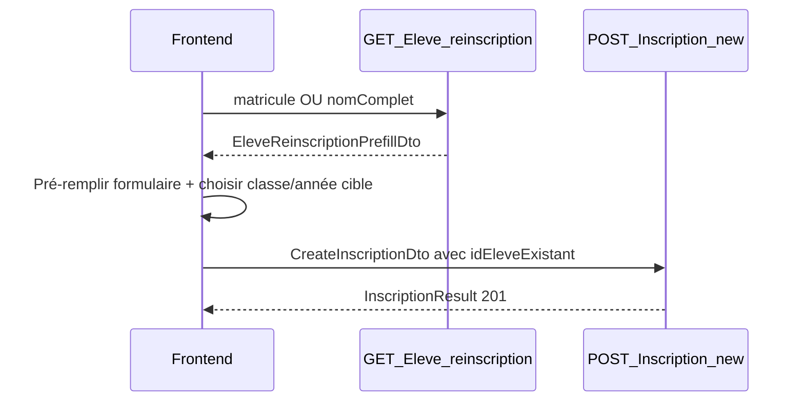

# Documentation Frontend — Réinscription élève

Guide d'intégration pour **Vue.js** (web admin) et **Flutter** (mobile / desktop).

**Base URL dev :** `https://localhost:7102` ou `https://dev-knb.asdc-rdc.org`  
**Swagger :** `/swagger/index.html`  
**Auth :** `Authorization: Bearer {jwt_token}`

---

## Table des matières

1. [Vue d'ensemble métier](#1-vue-densemble-métier)
2. [Authentification et périmètre école](#2-authentification-et-périmètre-école)
3. [Flux en 2 étapes](#3-flux-en-2-étapes)
4. [Étape 1 — GET /api/Eleve/reinscription](#4-étape-1--get-apielevereinscription)
5. [Champs de réponse et mapping formulaire](#5-champs-de-réponse-et-mapping-formulaire)
6. [Étape 2 — POST /api/Inscription/new/{nomEcole}](#6-étape-2--post-apiinscriptionnewnomecole)
7. [Modèles TypeScript (Vue.js)](#7-modèles-typescript-vuejs)
8. [Modèles Dart (Flutter)](#8-modèles-dart-flutter)
9. [Table de mapping prefill → CreateInscriptionDto](#9-table-de-mapping-prefill--createinscriptiondto)
10. [Intégration Vue.js](#10-intégration-vuejs)
11. [Intégration Flutter](#11-intégration-flutter)
12. [Gestion des erreurs](#12-gestion-des-erreurs)
13. [Checklist intégration](#13-checklist-intégration)
14. [Liens croisés](#14-liens-croisés)

---

## 1. Vue d'ensemble métier

### Problème résolu

Lors d'une **réinscription**, l'élève existe déjà dans l'école (année précédente). Avant cette API, le personnel devait **ressaisir manuellement** toutes les informations (élève, tuteur, adresse) alors qu'elles sont déjà en base.

Le nouvel endpoint **`GET /api/Eleve/reinscription`** permet de **rechercher** un élève par matricule ou nom complet et de **pré-remplir** le formulaire d'inscription.

### Acteurs

| Acteur | Rôle JWT | Usage |
|--------|----------|-------|
| Admin / Directeur / personnel scolarité | `Admin`, `Directeur`, etc. | Guichet réinscription dans son école |
| Super-Admin / IT-Support | `Super-Admin`, `IT-Support` | Doit passer `?idEcole=` en query |

### Règle métier clé

- Le **GET** cherche dans l'**année de référence** (par défaut **N-1**) : où l'élève était inscrit l'année dernière.
- Le **POST** crée l'inscription pour l'**année cible** (souvent l'année **courante**) et la **classe choisie** par l'utilisateur.

---

## 2. Authentification et périmètre école

### Headers obligatoires

```http
Authorization: Bearer {jwt_token}
Accept: application/json
```

### Résolution de `idEcole`

| Profil | Comportement |
|--------|--------------|
| Utilisateur rattaché à une école | `idEcole` lu depuis le claim JWT — **pas besoin** de le passer en query |
| Super-Admin / IT-Support | **`?idEcole={id}` obligatoire** en query, sinon `400` |

### Périmètre de recherche

Seuls les élèves ayant une inscription **active** (`statut = true`) et **confirmée** (`statutInscription` = Confirmé / variantes) dans l'école et l'**année de référence** sont retournés.

---

## 3. Flux en 2 étapes



### Écrans recommandés

1. **Recherche** — saisie matricule OU nom (autocomplete / liste)
2. **Formulaire pré-rempli** — données élève + tuteur en lecture/édition
3. **Sélection cible** — classe et année scolaire courante (dropdowns)
4. **Confirmation** — bandeau si déjà inscrit année courante
5. **Soumission** — POST inscription

---

## 4. Étape 1 — GET /api/Eleve/reinscription

### Informations générales

| Propriété | Valeur |
|-----------|--------|
| Méthode | `GET` |
| URL | `/api/Eleve/reinscription` |
| Auth | JWT requis |

### Paramètres query

| Paramètre | Type | Obligatoire | Description |
|-----------|------|-------------|-------------|
| `matricule` | string | XOR `nomComplet` | Recherche **exacte** → un seul résultat |
| `nomComplet` | string | XOR `matricule` | Recherche **partielle** (`Contains`) → liste paginée |
| `idEcole` | int | Non | École (défaut = JWT) |
| `idAnneeScolaire` | int | Non | Année **de référence** (historique) ; défaut = **année N-1** |
| `idClasse` | int | Non | Filtre : élèves inscrits dans cette classe (année ref.) |
| `PageNumber` | int | Non | Pagination (nomComplet), défaut `1` |
| `PageSize` | int | Non | Défaut `15`, max `100` |
| `SearchTerm` | string | Non | Filtre additionnel sur nom/matricule (nomComplet) |
| `IncludeInactive` | bool | Non | Défaut `false` |

**Validation :**

- Fournir **soit** `matricule`, **soit** `nomComplet` — pas les deux → `400`
- Aucun des deux → `400`

### Recherche par matricule

**Requête :**

```http
GET /api/Eleve/reinscription?matricule=ESK25-A3F2B1
Authorization: Bearer {token}
```

**Réponse `200` :**

```json
{
  "type": "Réinscription",
  "idEleveExistant": 42,
  "idTuteurExistant": 15,
  "idEcole": 28,
  "nomEleve": "Jean",
  "postnomEleve": "Kabila",
  "prenomEleve": "Marie",
  "photoEleveUrl": "https://cdn.example.com/photos/42.jpg",
  "matriculeEleve": "ESK25-A3F2B1",
  "genreEleve": "F",
  "dateNaissanceEleve": "2015-03-12T00:00:00",
  "lieuNaissanceEleve": "Kinshasa",
  "nationaliteEleve": "RDC",
  "provinceEleve": "Kinshasa",
  "villeEleve": "Kinshasa",
  "communeEleve": "Lemba",
  "quartierEleve": "Matete",
  "avenueEleve": "ByPass",
  "numeroEleve": "12",
  "commentaireEleve": null,
  "nomCompletTuteur": "Paul Kabila MULUMBA",
  "genreTuteur": "M",
  "emailTuteur": "paul.kabila@email.com",
  "telephoneTuteur": "+243900000123",
  "nomCompletRepresentant": null,
  "telephoneRepresentant": null,
  "photoTuteurUrl": null,
  "pieceIdentiteTuteur": null,
  "idAnneeScolaireReference": 18,
  "libelleAnneeScolaireReference": "2024-2025",
  "idInscriptionReference": 1205,
  "idClassePrecedente": 42,
  "nomClassePrecedente": "5e A",
  "dejaInscritAnneeCourante": false,
  "idInscriptionAnneeCourante": null
}
```

**Réponse `404` :**

```json
{
  "message": "Aucun élève trouvé avec le matricule 'ESK25-A3F2B1' pour cette école et l'année de référence."
}
```

### Recherche par nom complet (paginée)

**Requête :**

```http
GET /api/Eleve/reinscription?nomComplet=Kabila&PageNumber=1&PageSize=15
Authorization: Bearer {token}
```

**Réponse `200` :**

```json
{
  "data": {
    "data": [
      {
        "type": "Réinscription",
        "idEleveExistant": 42,
        "idTuteurExistant": 15,
        "idEcole": 28,
        "nomEleve": "Jean",
        "postnomEleve": "Kabila",
        "prenomEleve": "Marie",
        "matriculeEleve": "ESK25-A3F2B1",
        "genreEleve": "F",
        "dateNaissanceEleve": "2015-03-12T00:00:00",
        "nomCompletTuteur": "Paul Kabila MULUMBA",
        "telephoneTuteur": "+243900000123",
        "idAnneeScolaireReference": 18,
        "libelleAnneeScolaireReference": "2024-2025",
        "idClassePrecedente": 42,
        "nomClassePrecedente": "5e A",
        "dejaInscritAnneeCourante": false
      }
    ],
    "pageNumber": 1,
    "pageSize": 15,
    "totalPages": 1,
    "totalRecords": 1,
    "hasPrevious": false,
    "hasNext": false,
    "firstRowOnPage": 1,
    "lastRowOnPage": 1
  },
  "idEcole": 28,
  "idAnneeScolaire": 18
}
```

> **Note JSON :** ASP.NET Core sérialise en **camelCase** par défaut. Vérifiez la casse exacte dans Swagger si votre client est strict.

---

## 5. Champs de réponse et mapping formulaire

### Groupe A — Pré-remplissage direct (→ formulaire / POST)

Ces champs correspondent à `CreateInscriptionDto` :

| Champ prefill | Champ POST | Description |
|---------------|------------|-------------|
| `type` | `type` | Toujours `"Réinscription"` |
| `idEleveExistant` | `idEleveExistant` | **Critique** pour la réinscription |
| `idTuteurExistant` | `idTuteurExistant` | Tuteur existant |
| `idEcole` | `idEcole` | École |
| `nomEleve` | `nomEleve` | |
| `postnomEleve` | `postnomEleve` | |
| `prenomEleve` | `prenomEleve` | |
| `photoEleveUrl` | `photoEleveUrl` | |
| `matriculeEleve` | `matriculeEleve` | Conservé ; regénéré côté serveur si besoin |
| `genreEleve` | `genreEleve` | `M` / `F` |
| `dateNaissanceEleve` | `dateNaissanceEleve` | ISO 8601 |
| `lieuNaissanceEleve` | `lieuNaissanceEleve` | |
| `nationaliteEleve` | `nationaliteEleve` | |
| `provinceEleve` … `numeroEleve` | idem | Adresse élève |
| `commentaireEleve` | `commentaireEleve` | |
| `nomCompletTuteur` | `nomCompletTuteur` | |
| `genreTuteur` | `genreTuteur` | |
| `emailTuteur` | `emailTuteur` | |
| `telephoneTuteur` | `telephoneTuteur` | |
| `nomCompletRepresentant` | `nomCompletRepresentant` | |
| `telephoneRepresentant` | `telephoneRepresentant` | |
| `photoTuteurUrl` | `photoTuteurUrl` | |
| `pieceIdentiteTuteur` | `pieceIdentiteTuteur` | |

### Groupe B — Métadonnées (lecture seule, UX)

| Champ | Usage UI |
|-------|----------|
| `idAnneeScolaireReference` | Afficher « Données issues de l'année … » |
| `libelleAnneeScolaireReference` | Libellé année N-1 |
| `idInscriptionReference` | Debug / traçabilité |
| `idClassePrecedente` | **Suggestion** classe (passage en classe supérieure) |
| `nomClassePrecedente` | Affichage « Classe précédente : 5e A » |
| `dejaInscritAnneeCourante` | **Bandeau avertissement** si `true` |
| `idInscriptionAnneeCourante` | Lien vers fiche inscription existante |

### Règle UX — déjà inscrit année courante

Si `dejaInscritAnneeCourante === true` :

- Afficher un **avertissement** : « Cet élève possède déjà une inscription confirmée pour l'année en cours. »
- Proposer d'ouvrir la fiche existante (`idInscriptionAnneeCourante`).
- L'API **ne bloque pas** le POST ; c'est une aide à la décision côté front.

---

## 6. Étape 2 — POST /api/Inscription/new/{nomEcole}

### Informations générales

| Propriété | Valeur |
|-----------|--------|
| Méthode | `POST` |
| URL | `/api/Inscription/new/{nomEcole}` |
| Content-Type | `application/json` |
| Réponse succès | `201 Created` + `InscriptionResult` |
| Réponse erreur | `400 Bad Request` + `{ "error": "..." }` |

`{nomEcole}` : nom de l'école (URL-encodé), utilisé pour la génération de matricule. Ex. `/api/Inscription/new/Ecole%20Saint%20Joseph`.

### Champs à compléter côté front (non fournis par le GET)

| Champ | Source UI |
|-------|-----------|
| `idClasse` | Dropdown classes (année cible) |
| `idAnneeScolaire` | Année **courante** (pas l'année de référence du GET) |
| `dateInscription` | Date du jour ou saisie utilisateur |
| `statutInscription` | Défaut `"Confirmé"` |

### Exemple body réinscription

```json
{
  "type": "Réinscription",
  "idEcole": 28,
  "idClasse": 55,
  "idAnneeScolaire": 19,
  "dateInscription": "2026-08-30T10:00:00",
  "statutInscription": "Confirmé",
  "idEleveExistant": 42,
  "idTuteurExistant": 15,
  "nomEleve": "Jean",
  "postnomEleve": "Kabila",
  "prenomEleve": "Marie",
  "genreEleve": "F",
  "dateNaissanceEleve": "2015-03-12T00:00:00",
  "lieuNaissanceEleve": "Kinshasa",
  "nationaliteEleve": "RDC",
  "provinceEleve": "Kinshasa",
  "villeEleve": "Kinshasa",
  "communeEleve": "Lemba",
  "quartierEleve": "Matete",
  "avenueEleve": "ByPass",
  "numeroEleve": "12",
  "nomCompletTuteur": "Paul Kabila MULUMBA",
  "genreTuteur": "M",
  "emailTuteur": "paul.kabila@email.com",
  "telephoneTuteur": "+243900000123"
}
```

### Réponse succès `201`

```json
{
  "success": true,
  "message": "Réinscription effectuée avec succès. Élève existant réutilisé (ID: 42).",
  "idInscription": 1500,
  "idEleve": 42,
  "idTuteur": 15,
  "inscription": { },
  "compteUtilisateurTuteur": null
}
```

> Doc complète POST : voir `docs/archive/md/ENDPOINT_INSCRIPTION_NEW_DOCUMENTATION.md`

---

## 7. Modèles TypeScript (Vue.js)

```typescript
// types/reinscription.ts

export interface EleveReinscriptionPrefillDto {
  type: string;
  idEleveExistant?: number | null;
  idTuteurExistant?: number | null;
  idEcole: number;
  nomEleve?: string | null;
  postnomEleve?: string | null;
  prenomEleve?: string | null;
  photoEleveUrl?: string | null;
  matriculeEleve?: string | null;
  genreEleve?: string | null;
  dateNaissanceEleve: string;
  lieuNaissanceEleve?: string | null;
  nationaliteEleve?: string | null;
  provinceEleve?: string | null;
  villeEleve?: string | null;
  communeEleve?: string | null;
  quartierEleve?: string | null;
  avenueEleve?: string | null;
  numeroEleve?: string | null;
  commentaireEleve?: string | null;
  nomCompletTuteur?: string | null;
  genreTuteur?: string | null;
  emailTuteur?: string | null;
  telephoneTuteur?: string | null;
  nomCompletRepresentant?: string | null;
  telephoneRepresentant?: string | null;
  photoTuteurUrl?: string | null;
  pieceIdentiteTuteur?: string | null;
  idAnneeScolaireReference: number;
  libelleAnneeScolaireReference?: string | null;
  idInscriptionReference?: number | null;
  idClassePrecedente?: number | null;
  nomClassePrecedente?: string | null;
  dejaInscritAnneeCourante: boolean;
  idInscriptionAnneeCourante?: number | null;
}

export interface PagedResult<T> {
  data: T[];
  pageNumber: number;
  pageSize: number;
  totalPages: number;
  totalRecords: number;
  hasPrevious: boolean;
  hasNext: boolean;
  firstRowOnPage: number;
  lastRowOnPage: number;
}

export interface ElevesAnneeScopedResult<T> {
  data: T;
  idEcole: number;
  idAnneeScolaire: number;
}

export interface CreateInscriptionDto {
  type: 'Inscription' | 'Réinscription';
  idEcole: number;
  idClasse: number;
  idAnneeScolaire: number;
  dateInscription: string;
  statutInscription: string;
  nomEleve: string;
  postnomEleve: string;
  prenomEleve: string;
  genreEleve: string;
  dateNaissanceEleve: string;
  lieuNaissanceEleve: string;
  nationaliteEleve: string;
  nomCompletTuteur: string;
  genreTuteur: string;
  photoEleveUrl?: string | null;
  matriculeEleve?: string | null;
  provinceEleve?: string | null;
  villeEleve?: string | null;
  communeEleve?: string | null;
  quartierEleve?: string | null;
  avenueEleve?: string | null;
  numeroEleve?: string | null;
  commentaireEleve?: string | null;
  emailTuteur?: string | null;
  telephoneTuteur?: string | null;
  nomCompletRepresentant?: string | null;
  telephoneRepresentant?: string | null;
  photoTuteurUrl?: string | null;
  pieceIdentiteTuteur?: string | null;
  idEleveExistant?: number | null;
  idTuteurExistant?: number | null;
}

export interface InscriptionResult {
  success: boolean;
  message: string;
  idInscription?: number | null;
  idEleve?: number | null;
  idTuteur?: number | null;
}

export interface ReinscriptionSearchOptions {
  idEcole?: number;
  idAnneeScolaire?: number;
  idClasse?: number;
}
```

---

## 8. Modèles Dart (Flutter)

L'API renvoie du **camelCase**. Avec `json_serializable`, utilisez `@JsonSerializable(fieldRename: FieldRename.none)` et des noms de champs camelCase, **ou** `@JsonKey(name: 'nomEleve')` si vos propriétés Dart sont en snake_case.

```dart
// lib/models/eleve_reinscription_prefill_dto.dart

class EleveReinscriptionPrefillDto {
  final String type;
  final int? idEleveExistant;
  final int? idTuteurExistant;
  final int idEcole;
  final String? nomEleve;
  final String? postnomEleve;
  final String? prenomEleve;
  final String? matriculeEleve;
  final String? genreEleve;
  final DateTime dateNaissanceEleve;
  final String? lieuNaissanceEleve;
  final String? nationaliteEleve;
  final String? nomCompletTuteur;
  final String? genreTuteur;
  final String? emailTuteur;
  final String? telephoneTuteur;
  final int idAnneeScolaireReference;
  final String? libelleAnneeScolaireReference;
  final int? idClassePrecedente;
  final String? nomClassePrecedente;
  final bool dejaInscritAnneeCourante;
  final int? idInscriptionAnneeCourante;

  EleveReinscriptionPrefillDto({
    required this.type,
    this.idEleveExistant,
    this.idTuteurExistant,
    required this.idEcole,
    this.nomEleve,
    this.postnomEleve,
    this.prenomEleve,
    this.matriculeEleve,
    this.genreEleve,
    required this.dateNaissanceEleve,
    this.lieuNaissanceEleve,
    this.nationaliteEleve,
    this.nomCompletTuteur,
    this.genreTuteur,
    this.emailTuteur,
    this.telephoneTuteur,
    required this.idAnneeScolaireReference,
    this.libelleAnneeScolaireReference,
    this.idClassePrecedente,
    this.nomClassePrecedente,
    required this.dejaInscritAnneeCourante,
    this.idInscriptionAnneeCourante,
  });

  factory EleveReinscriptionPrefillDto.fromJson(Map<String, dynamic> json) {
    return EleveReinscriptionPrefillDto(
      type: json['type'] as String? ?? 'Réinscription',
      idEleveExistant: json['idEleveExistant'] as int?,
      idTuteurExistant: json['idTuteurExistant'] as int?,
      idEcole: json['idEcole'] as int,
      nomEleve: json['nomEleve'] as String?,
      postnomEleve: json['postnomEleve'] as String?,
      prenomEleve: json['prenomEleve'] as String?,
      matriculeEleve: json['matriculeEleve'] as String?,
      genreEleve: json['genreEleve'] as String?,
      dateNaissanceEleve: DateTime.parse(json['dateNaissanceEleve'] as String),
      lieuNaissanceEleve: json['lieuNaissanceEleve'] as String?,
      nationaliteEleve: json['nationaliteEleve'] as String?,
      nomCompletTuteur: json['nomCompletTuteur'] as String?,
      genreTuteur: json['genreTuteur'] as String?,
      emailTuteur: json['emailTuteur'] as String?,
      telephoneTuteur: json['telephoneTuteur'] as String?,
      idAnneeScolaireReference: json['idAnneeScolaireReference'] as int,
      libelleAnneeScolaireReference: json['libelleAnneeScolaireReference'] as String?,
      idClassePrecedente: json['idClassePrecedente'] as int?,
      nomClassePrecedente: json['nomClassePrecedente'] as String?,
      dejaInscritAnneeCourante: json['dejaInscritAnneeCourante'] as bool? ?? false,
      idInscriptionAnneeCourante: json['idInscriptionAnneeCourante'] as int?,
    );
  }
}

class PagedResult<T> {
  final List<T> data;
  final int pageNumber;
  final int pageSize;
  final int totalPages;
  final int totalRecords;
  final bool hasNext;

  PagedResult({
    required this.data,
    required this.pageNumber,
    required this.pageSize,
    required this.totalPages,
    required this.totalRecords,
    required this.hasNext,
  });
}

class ElevesAnneeScopedResult<T> {
  final T data;
  final int idEcole;
  final int idAnneeScolaire;

  ElevesAnneeScopedResult({
    required this.data,
    required this.idEcole,
    required this.idAnneeScolaire,
  });
}
```

---

## 9. Table de mapping prefill → CreateInscriptionDto

Fonction utilitaire recommandée (Vue.js / Flutter) :

```typescript
export function prefillToCreateInscriptionDto(
  prefill: EleveReinscriptionPrefillDto,
  target: {
    idClasse: number;
    idAnneeScolaire: number;
    dateInscription?: string;
  }
): CreateInscriptionDto {
  return {
    type: 'Réinscription',
    idEcole: prefill.idEcole,
    idClasse: target.idClasse,
    idAnneeScolaire: target.idAnneeScolaire,
    dateInscription: target.dateInscription ?? new Date().toISOString(),
    statutInscription: 'Confirmé',
    idEleveExistant: prefill.idEleveExistant ?? undefined,
    idTuteurExistant: prefill.idTuteurExistant ?? undefined,
    nomEleve: prefill.nomEleve ?? '',
    postnomEleve: prefill.postnomEleve ?? '',
    prenomEleve: prefill.prenomEleve ?? '',
    genreEleve: prefill.genreEleve ?? 'M',
    dateNaissanceEleve: prefill.dateNaissanceEleve,
    lieuNaissanceEleve: prefill.lieuNaissanceEleve ?? '',
    nationaliteEleve: prefill.nationaliteEleve ?? 'RDC',
    photoEleveUrl: prefill.photoEleveUrl,
    matriculeEleve: prefill.matriculeEleve,
    provinceEleve: prefill.provinceEleve,
    villeEleve: prefill.villeEleve,
    communeEleve: prefill.communeEleve,
    quartierEleve: prefill.quartierEleve,
    avenueEleve: prefill.avenueEleve,
    numeroEleve: prefill.numeroEleve,
    commentaireEleve: prefill.commentaireEleve,
    nomCompletTuteur: prefill.nomCompletTuteur ?? '',
    genreTuteur: prefill.genreTuteur ?? 'M',
    emailTuteur: prefill.emailTuteur,
    telephoneTuteur: prefill.telephoneTuteur,
    nomCompletRepresentant: prefill.nomCompletRepresentant,
    telephoneRepresentant: prefill.telephoneRepresentant,
    photoTuteurUrl: prefill.photoTuteurUrl,
    pieceIdentiteTuteur: prefill.pieceIdentiteTuteur,
  };
}
```

Équivalent Dart :

```dart
Map<String, dynamic> prefillToCreateInscriptionJson(
  EleveReinscriptionPrefillDto prefill, {
  required int idClasse,
  required int idAnneeScolaire,
  DateTime? dateInscription,
}) {
  return {
    'type': 'Réinscription',
    'idEcole': prefill.idEcole,
    'idClasse': idClasse,
    'idAnneeScolaire': idAnneeScolaire,
    'dateInscription': (dateInscription ?? DateTime.now()).toIso8601String(),
    'statutInscription': 'Confirmé',
    'idEleveExistant': prefill.idEleveExistant,
    'idTuteurExistant': prefill.idTuteurExistant,
    'nomEleve': prefill.nomEleve ?? '',
    'postnomEleve': prefill.postnomEleve ?? '',
    'prenomEleve': prefill.prenomEleve ?? '',
    'genreEleve': prefill.genreEleve ?? 'M',
    'dateNaissanceEleve': prefill.dateNaissanceEleve.toIso8601String(),
    'lieuNaissanceEleve': prefill.lieuNaissanceEleve ?? '',
    'nationaliteEleve': prefill.nationaliteEleve ?? 'RDC',
    'nomCompletTuteur': prefill.nomCompletTuteur ?? '',
    'genreTuteur': prefill.genreTuteur ?? 'M',
    'emailTuteur': prefill.emailTuteur,
    'telephoneTuteur': prefill.telephoneTuteur,
  };
}
```

---

## 10. Intégration Vue.js

### Service API

```typescript
// services/reinscriptionService.ts
import type {
  EleveReinscriptionPrefillDto,
  ElevesAnneeScopedResult,
  PagedResult,
  CreateInscriptionDto,
  InscriptionResult,
  ReinscriptionSearchOptions,
} from '@/types/reinscription';

const API_BASE = import.meta.env.VITE_API_URL ?? 'https://localhost:7102';

function authHeaders(token: string): HeadersInit {
  return {
    Authorization: `Bearer ${token}`,
    Accept: 'application/json',
  };
}

function buildQuery(params: Record<string, string | number | undefined>): string {
  const q = new URLSearchParams();
  Object.entries(params).forEach(([k, v]) => {
    if (v !== undefined && v !== '') q.set(k, String(v));
  });
  return q.toString();
}

export async function searchByMatricule(
  token: string,
  matricule: string,
  options?: ReinscriptionSearchOptions
): Promise<EleveReinscriptionPrefillDto> {
  const query = buildQuery({
    matricule: matricule.trim(),
    idEcole: options?.idEcole,
    idAnneeScolaire: options?.idAnneeScolaire,
    idClasse: options?.idClasse,
  });

  const res = await fetch(`${API_BASE}/api/Eleve/reinscription?${query}`, {
    headers: authHeaders(token),
  });

  if (res.status === 404) {
    const body = await res.json();
    throw new Error(body.message ?? 'Élève non trouvé');
  }
  if (!res.ok) {
    const body = await res.json().catch(() => ({}));
    throw new Error(body.message ?? `Erreur ${res.status}`);
  }

  return res.json();
}

export async function searchByNomComplet(
  token: string,
  nomComplet: string,
  pageNumber = 1,
  pageSize = 15,
  options?: ReinscriptionSearchOptions
): Promise<ElevesAnneeScopedResult<PagedResult<EleveReinscriptionPrefillDto>>> {
  const query = buildQuery({
    nomComplet: nomComplet.trim(),
    PageNumber: pageNumber,
    PageSize: pageSize,
    idEcole: options?.idEcole,
    idAnneeScolaire: options?.idAnneeScolaire,
    idClasse: options?.idClasse,
  });

  const res = await fetch(`${API_BASE}/api/Eleve/reinscription?${query}`, {
    headers: authHeaders(token),
  });

  if (!res.ok) {
    const body = await res.json().catch(() => ({}));
    throw new Error(body.message ?? `Erreur ${res.status}`);
  }

  return res.json();
}

export async function submitReinscription(
  token: string,
  nomEcole: string,
  payload: CreateInscriptionDto
): Promise<InscriptionResult> {
  const encoded = encodeURIComponent(nomEcole);
  const res = await fetch(`${API_BASE}/api/Inscription/new/${encoded}`, {
    method: 'POST',
    headers: {
      ...authHeaders(token),
      'Content-Type': 'application/json',
    },
    body: JSON.stringify(payload),
  });

  const body = await res.json();
  if (!res.ok) {
    throw new Error(body.error ?? body.message ?? 'Échec de la réinscription');
  }
  return body;
}
```

### Composant écran (extrait)

```vue
<!-- views/ReinscriptionGuichet.vue -->
<script setup lang="ts">
import { ref } from 'vue';
import {
  searchByMatricule,
  searchByNomComplet,
  submitReinscription,
} from '@/services/reinscriptionService';
import { prefillToCreateInscriptionDto } from '@/utils/reinscriptionMapper';
import type { EleveReinscriptionPrefillDto } from '@/types/reinscription';

const props = defineProps<{
  token: string;
  nomEcole: string;
  idAnneeCourante: number;
}>();

const mode = ref<'matricule' | 'nom'>('matricule');
const matricule = ref('');
const nomComplet = ref('');
const prefill = ref<EleveReinscriptionPrefillDto | null>(null);
const candidats = ref<EleveReinscriptionPrefillDto[]>([]);
const idClasseCible = ref<number | null>(null);
const loading = ref(false);
const error = ref<string | null>(null);

async function rechercher() {
  loading.value = true;
  error.value = null;
  prefill.value = null;
  candidats.value = [];
  try {
    if (mode.value === 'matricule') {
      prefill.value = await searchByMatricule(props.token, matricule.value);
    } else {
      const result = await searchByNomComplet(props.token, nomComplet.value);
      candidats.value = result.data.data;
    }
  } catch (e: unknown) {
    error.value = e instanceof Error ? e.message : 'Erreur recherche';
  } finally {
    loading.value = false;
  }
}

function selectCandidat(c: EleveReinscriptionPrefillDto) {
  prefill.value = c;
  candidats.value = [];
}

async function valider() {
  if (!prefill.value || !idClasseCible.value) return;
  const payload = prefillToCreateInscriptionDto(prefill.value, {
    idClasse: idClasseCible.value,
    idAnneeScolaire: props.idAnneeCourante,
  });
  await submitReinscription(props.token, props.nomEcole, payload);
}
</script>

<template>
  <div class="reinscription-guichet">
    <div v-if="error" class="alert alert-danger">{{ error }}</div>

    <div v-if="prefill?.dejaInscritAnneeCourante" class="alert alert-warning">
      Cet élève est déjà inscrit pour l'année en cours
      (inscription #{{ prefill.idInscriptionAnneeCourante }}).
    </div>

    <div v-if="prefill" class="mt-3">
      <p>Classe précédente : {{ prefill.nomClassePrecedente }} ({{ prefill.libelleAnneeScolaireReference }})</p>
      <!-- Formulaire pré-rempli + select idClasseCible -->
      <button @click="valider">Confirmer la réinscription</button>
    </div>

    <ul v-if="candidats.length">
      <li v-for="c in candidats" :key="c.idEleveExistant!" @click="selectCandidat(c)">
        {{ c.nomEleve }} {{ c.postnomEleve }} {{ c.prenomEleve }} — {{ c.matriculeEleve }}
      </li>
    </ul>
  </div>
</template>
```

---

## 11. Intégration Flutter

### Service API (Dio)

```dart
// lib/services/reinscription_api_service.dart
import 'package:dio/dio.dart';
import '../models/eleve_reinscription_prefill_dto.dart';

class ReinscriptionApiService {
  ReinscriptionApiService(this._dio, {required this.baseUrl});

  final Dio _dio;
  final String baseUrl;

  Options _authOptions(String token) => Options(
        headers: {
          'Authorization': 'Bearer $token',
          'Accept': 'application/json',
        },
      );

  Future<EleveReinscriptionPrefillDto> searchByMatricule(
    String token,
    String matricule, {
    int? idEcole,
    int? idAnneeScolaire,
    int? idClasse,
  }) async {
    final response = await _dio.get<Map<String, dynamic>>(
      '$baseUrl/api/Eleve/reinscription',
      queryParameters: {
        'matricule': matricule.trim(),
        if (idEcole != null) 'idEcole': idEcole,
        if (idAnneeScolaire != null) 'idAnneeScolaire': idAnneeScolaire,
        if (idClasse != null) 'idClasse': idClasse,
      },
      options: _authOptions(token),
    );

    return EleveReinscriptionPrefillDto.fromJson(response.data!);
  }

  Future<ElevesAnneeScopedResult<PagedResult<EleveReinscriptionPrefillDto>>>
      searchByNomComplet(
    String token,
    String nomComplet, {
    int pageNumber = 1,
    int pageSize = 15,
    int? idEcole,
    int? idAnneeScolaire,
  }) async {
    final response = await _dio.get<Map<String, dynamic>>(
      '$baseUrl/api/Eleve/reinscription',
      queryParameters: {
        'nomComplet': nomComplet.trim(),
        'PageNumber': pageNumber,
        'PageSize': pageSize,
        if (idEcole != null) 'idEcole': idEcole,
        if (idAnneeScolaire != null) 'idAnneeScolaire': idAnneeScolaire,
      },
      options: _authOptions(token),
    );

    final json = response.data!;
    final pageJson = json['data'] as Map<String, dynamic>;
    final items = (pageJson['data'] as List<dynamic>)
        .map((e) => EleveReinscriptionPrefillDto.fromJson(e as Map<String, dynamic>))
        .toList();

    return ElevesAnneeScopedResult(
      data: PagedResult(
        data: items,
        pageNumber: pageJson['pageNumber'] as int,
        pageSize: pageJson['pageSize'] as int,
        totalPages: pageJson['totalPages'] as int,
        totalRecords: pageJson['totalRecords'] as int,
        hasNext: pageJson['hasNext'] as bool? ?? false,
      ),
      idEcole: json['idEcole'] as int,
      idAnneeScolaire: json['idAnneeScolaire'] as int,
    );
  }

  Future<Map<String, dynamic>> submitReinscription(
    String token,
    String nomEcole,
    Map<String, dynamic> payload,
  ) async {
    final encoded = Uri.encodeComponent(nomEcole);
    final response = await _dio.post<Map<String, dynamic>>(
      '$baseUrl/api/Inscription/new/$encoded',
      data: payload,
      options: Options(
        headers: {
          ..._authOptions(token).headers!,
          'Content-Type': 'application/json',
        },
      ),
    );
    return response.data!;
  }
}
```

### Widget recherche (extrait)

```dart
// lib/screens/reinscription_search_screen.dart
class ReinscriptionSearchScreen extends StatefulWidget {
  const ReinscriptionSearchScreen({
    super.key,
    required this.api,
    required this.token,
    required this.idAnneeCourante,
    required this.nomEcole,
  });

  final ReinscriptionApiService api;
  final String token;
  final int idAnneeCourante;
  final String nomEcole;

  @override
  State<ReinscriptionSearchScreen> createState() => _ReinscriptionSearchScreenState();
}

class _ReinscriptionSearchScreenState extends State<ReinscriptionSearchScreen> {
  final _matriculeCtrl = TextEditingController();
  bool _loading = false;
  String? _error;
  EleveReinscriptionPrefillDto? _prefill;
  List<EleveReinscriptionPrefillDto> _candidats = [];

  Future<void> _searchMatricule() async {
    setState(() { _loading = true; _error = null; _prefill = null; });
    try {
      final result = await widget.api.searchByMatricule(
        widget.token,
        _matriculeCtrl.text,
      );
      setState(() => _prefill = result);
    } on DioException catch (e) {
      setState(() => _error = e.response?.data?['message'] ?? e.message);
    } finally {
      setState(() => _loading = false);
    }
  }

  @override
  Widget build(BuildContext context) {
    return Scaffold(
      appBar: AppBar(title: const Text('Réinscription')),
      body: Column(
        children: [
          if (_error != null)
            MaterialBanner(content: Text(_error!), actions: const []),
          if (_prefill?.dejaInscritAnneeCourante == true)
            const MaterialBanner(
              content: Text('Élève déjà inscrit pour l\'année en cours'),
              backgroundColor: Colors.orange,
            ),
          TextField(
            controller: _matriculeCtrl,
            decoration: const InputDecoration(labelText: 'Matricule'),
          ),
          ElevatedButton(
            onPressed: _loading ? null : _searchMatricule,
            child: _loading
                ? const CircularProgressIndicator()
                : const Text('Rechercher'),
          ),
          if (_prefill != null)
            ListTile(
              title: Text('${_prefill!.nomEleve} ${_prefill!.postnomEleve}'),
              subtitle: Text('Classe précédente : ${_prefill!.nomClassePrecedente}'),
              onTap: () => Navigator.pushNamed(
                context,
                '/reinscription/form',
                arguments: _prefill,
              ),
            ),
        ],
      ),
    );
  }
}
```

### Gestion Dio 404

```dart
try {
  await api.searchByMatricule(token, matricule);
} on DioException catch (e) {
  if (e.response?.statusCode == 404) {
    // Afficher : élève non trouvé pour cette école / année de référence
  } else if (e.response?.statusCode == 400) {
    // Paramètres invalides ou année N-1 absente
  } else if (e.response?.statusCode == 401) {
    // Rediriger vers login
  }
}
```

---

## 12. Gestion des erreurs

| Code HTTP | Endpoint | Cas | Action UI |
|-----------|----------|-----|-----------|
| `400` | GET | `matricule` + `nomComplet` fournis | « Choisissez un seul critère de recherche » |
| `400` | GET | Aucun critère | « Saisissez un matricule ou un nom » |
| `400` | GET | Pas d'année N-1 en BDD | Proposer sélecteur `idAnneeScolaire` manuel |
| `404` | GET | Matricule inconnu | « Élève non trouvé dans cette école » |
| `401` | GET/POST | Token absent/expiré | Redirection login |
| `400` | POST | Validation métier | Afficher `error` du body |
| `201` | POST | Succès | Toast + redirection fiche inscription |

### Messages API typiques (GET)

```json
{ "message": "Fournissez soit matricule, soit nomComplet, pas les deux." }
{ "message": "Le paramètre matricule ou nomComplet est requis." }
{ "message": "Aucune année scolaire de référence pour l'école 28. Précisez idAnneeScolaire..." }
```

### Messages API typiques (POST)

```json
{ "error": "❌ La classe avec l'ID 99 n'existe pas ou n'est pas active." }
{ "error": "❌ L'année scolaire avec l'ID 20 n'existe pas ou n'est pas active." }
```

---

## 13. Checklist intégration

- [ ] Écran recherche avec onglets **Matricule** / **Nom complet**
- [ ] Appel `GET /api/Eleve/reinscription` avec token JWT
- [ ] Liste paginée pour recherche par nom (`PageNumber`, `PageSize`, `hasNext`)
- [ ] Sélection d'un candidat dans la liste → pré-remplissage
- [ ] Affichage classe précédente (`nomClassePrecedente`) comme info
- [ ] Dropdown **classe cible** + **année courante** (distincte de l'année de référence du GET)
- [ ] Bandeau warning si `dejaInscritAnneeCourante === true`
- [ ] Mapping prefill → `CreateInscriptionDto` avec `idEleveExistant`
- [ ] Soumission `POST /api/Inscription/new/{nomEcole}`
- [ ] Gestion erreurs 400 / 404 / 401
- [ ] Test manuel via Swagger avant mise en prod
- [ ] Super-Admin : passage explicite de `?idEcole=`

---

## 14. Liens croisés

| Ressource | Chemin |
|-----------|--------|
| Swagger | `/swagger/index.html` → `Eleve` → `GET /api/Eleve/reinscription` |
| POST inscription (archive) | `docs/archive/md/ENDPOINT_INSCRIPTION_NEW_DOCUMENTATION.md` |
| Pagination | `DOCUMENTATION_PAGINATION.md` |
| Doc front MOKO (modèle) | `DOCUMENTATION_FRONTEND_PAIEMENT_MOKO.md` |
| DTO API | `Models/DTOs/EleveReinscriptionPrefillDto.cs` |
| Controller | `Controllers/EleveController.cs` |

---

**Dernière mise à jour :** 30 août 2026  
**Version API :** compatible KelasiNaBiso API v2 (endpoint réinscription GET)
