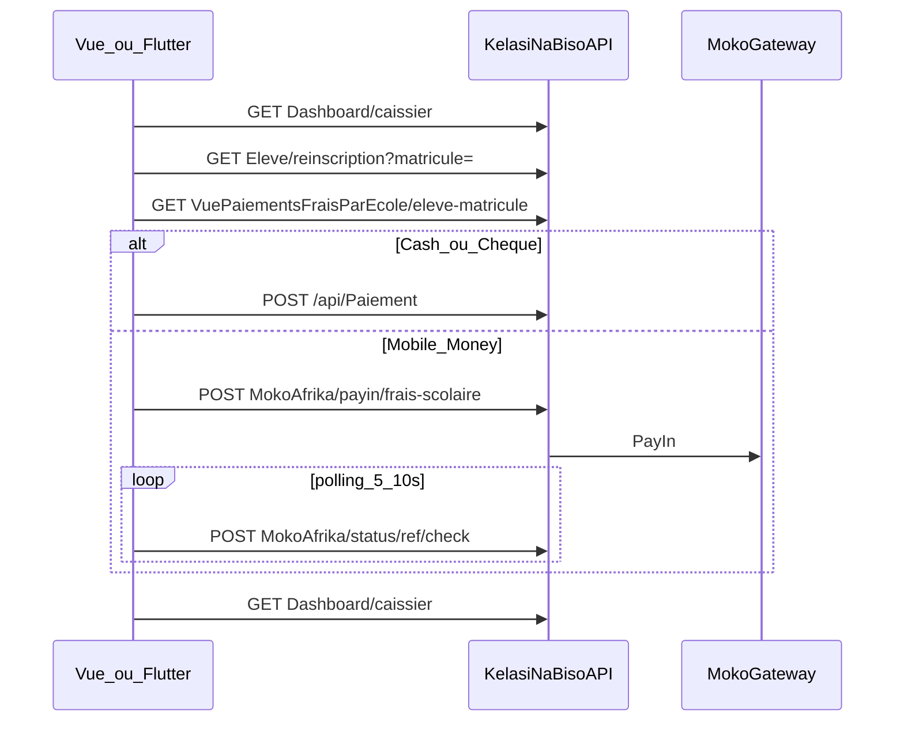

# Intégration Vue 3 & Flutter — Rôle Caissier (écran guichet)

Guide d'implémentation pour l'**écran guichet** côté **Vue 3** (web) et **Flutter** (tablette / mobile).

**Références API :**
- [DOCUMENTATION_FRONTEND_ROLE_CAISSIER.md](DOCUMENTATION_FRONTEND_ROLE_CAISSIER.md) — endpoints et parcours métier
- [DOCUMENTATION_FRONTEND_PAIEMENT_MOKO.md](DOCUMENTATION_FRONTEND_PAIEMENT_MOKO.md) — PayIn Moko, polling USSD
- [DOCUMENTATION_FRONTEND_VITRINE_VUE.md](DOCUMENTATION_FRONTEND_VITRINE_VUE.md) — conventions client API Vue

**Base URL dev :** `https://dev-knb.asdc-rdc.org`  
**Auth :** `Authorization: Bearer {jwt_token}`

---

## Table des matières

1. [Prérequis et routing](#1-prérequis-et-routing)
2. [Architecture des écrans](#2-architecture-des-écrans)
3. [Vue 3 — configuration](#3-vue-3--configuration)
4. [Vue 3 — client API et types](#4-vue-3--client-api-et-types)
5. [Vue 3 — composables](#5-vue-3--composables)
6. [Vue 3 — écrans exemples](#6-vue-3--écrans-exemples)
7. [Flutter — configuration](#7-flutter--configuration)
8. [Flutter — modèles et service API](#8-flutter--modèles-et-service-api)
9. [Flutter — state et écrans](#9-flutter--state-et-écrans)
10. [Flux encaissement](#10-flux-encaissement)
11. [Clôture et impression](#11-clôture-et-impression)
12. [Supervision (Directeur / Financier)](#12-supervision-directeur--financier)
13. [Gestion des erreurs](#13-gestion-des-erreurs)
14. [Checklist d'intégration](#14-checklist-dintégration)

---

## 1. Prérequis et routing

### JWT — claims utiles

| Claim | Usage front |
|-------|-------------|
| `sub` | Id utilisateur (`idUtilisateur`) — journal paginé, filtre caisse |
| `idEcole` | Id école — **obligatoire** sur tous les appels guichet |
| `role` (plusieurs) | `Caissier`, `Directeur`, `Financier`, etc. |

**Rôles autorisés sur le guichet :** `Caissier`, `Directeur`, `Financier`, `Admin`, `Super-Admin`.

**Reconnexion obligatoire** après migration prod du rôle Caissier (nouveau claim JWT).

### Vue Router — garde de route

```javascript
// router/index.js
const GUICHET_ROLES = ['Caissier', 'Directeur', 'Financier', 'Admin', 'Super-Admin'];

router.beforeEach((to, from, next) => {
  if (!to.meta.requiresGuichet) return next();

  const auth = useAuthStore();
  if (!auth.token) return next({ name: 'login', query: { redirect: to.fullPath } });

  const hasRole = auth.roles.some(r => GUICHET_ROLES.includes(r));
  if (!hasRole) return next({ name: 'forbidden' });

  next();
});

// routes
{
  path: '/guichet',
  name: 'guichet',
  component: () => import('@/views/guichet/GuichetHome.vue'),
  meta: { requiresGuichet: true }
},
{
  path: '/guichet/recherche',
  name: 'guichet-recherche',
  component: () => import('@/views/guichet/GuichetRecherche.vue'),
  meta: { requiresGuichet: true }
},
{
  path: '/guichet/encaissement',
  name: 'guichet-encaissement',
  component: () => import('@/views/guichet/GuichetEncaissement.vue'),
  meta: { requiresGuichet: true }
},
{
  path: '/guichet/journal',
  name: 'guichet-journal',
  component: () => import('@/views/guichet/GuichetJournal.vue'),
  meta: { requiresGuichet: true }
},
{
  path: '/guichet/cloture',
  name: 'guichet-cloture',
  component: () => import('@/views/guichet/GuichetCloture.vue'),
  meta: { requiresGuichet: true }
}
```

**Redirection post-login :** si rôle principal = `Caissier` → `/guichet`.

### Flutter — GoRouter

```dart
// lib/core/router/app_router.dart
const guichetRoles = {'Caissier', 'Directeur', 'Financier', 'Admin', 'Super-Admin'};

GoRoute(
  path: '/guichet',
  redirect: (context, state) {
    final auth = context.read<AuthProvider>();
    if (!auth.isAuthenticated) return '/login';
    if (!auth.roles.any(guichetRoles.contains)) return '/forbidden';
    return null;
  },
  routes: [
    GoRoute(path: '', builder: (_, __) => const GuichetHomeScreen()),
    GoRoute(path: 'recherche', builder: (_, __) => const GuichetRechercheScreen()),
    GoRoute(path: 'encaissement', builder: (_, __) => const GuichetEncaissementScreen()),
    GoRoute(path: 'journal', builder: (_, __) => const GuichetJournalScreen()),
    GoRoute(path: 'cloture', builder: (_, __) => const GuichetClotureScreen()),
  ],
),
```

---

## 2. Architecture des écrans

| Écran | Route | Endpoints |
|-------|-------|-----------|
| Accueil caisse | `/guichet` | `GET /api/Dashboard/caissier` |
| Recherche élève | `/guichet/recherche` | `GET /api/Eleve/reinscription?matricule=` |
| Frais / solde | step encaissement | `GET /api/VuePaiementsFraisParEcole/eleve-matricule/{matricule}` |
| Encaissement Cash | modal / step | `POST /api/Paiement` |
| Encaissement Moko | modal / step | PayIn + polling (doc Moko) |
| Journal | `/guichet/journal` | `GET /api/Paiement/paged?idUtilisateur=` |
| Clôture | `/guichet/cloture` | `GET /api/Dashboard/caissier/cloture` |

**Règle :** toujours passer `idEcole` depuis le JWT, jamais saisi librement par l'utilisateur.

---

## 3. Vue 3 — configuration

### Variables d'environnement

`.env.development`

```env
VITE_API_BASE_URL=https://dev-knb.asdc-rdc.org
```

`.env.production`

```env
VITE_API_BASE_URL=https://votre-api-prod.asdc-rdc.org
```

### Store auth minimal (Pinia)

```javascript
// stores/auth.js
import { defineStore } from 'pinia';
import { jwtDecode } from 'jwt-decode';

export const useAuthStore = defineStore('auth', {
  state: () => ({
    token: localStorage.getItem('token') || null,
    userId: null,
    idEcole: null,
    roles: []
  }),
  actions: {
    setToken(token) {
      this.token = token;
      localStorage.setItem('token', token);
      const payload = jwtDecode(token);
      this.userId = parseInt(payload.sub, 10);
      this.idEcole = parseInt(payload.idEcole, 10);
      this.roles = payload.role
        ? (Array.isArray(payload.role) ? payload.role : [payload.role])
        : [];
    },
    logout() {
      this.token = null;
      localStorage.removeItem('token');
    }
  }
});
```

---

## 4. Vue 3 — client API et types

### Client HTTP

`src/api/http.js`

```javascript
import { useAuthStore } from '@/stores/auth';

const API_BASE = import.meta.env.VITE_API_BASE_URL?.replace(/\/$/, '') || '';

export async function parseApiError(res) {
  const body = await res.json().catch(() => ({}));
  const err = new Error(body.message || body.title || `Erreur API ${res.status}`);
  err.status = res.status;
  err.code = body.code;
  err.body = body;
  return err;
}

export async function apiFetch(path, options = {}) {
  const auth = useAuthStore();
  const headers = {
    Accept: 'application/json',
    ...(options.body ? { 'Content-Type': 'application/json' } : {}),
    ...(auth.token ? { Authorization: `Bearer ${auth.token}` } : {}),
    ...options.headers
  };

  const res = await fetch(`${API_BASE}${path}`, { ...options, headers });
  if (!res.ok) throw await parseApiError(res);
  if (res.status === 204) return null;
  return res.json();
}
```

### Service guichet

`src/api/guichet.js`

```javascript
import { apiFetch } from './http';

function buildQuery(params) {
  const q = new URLSearchParams();
  Object.entries(params).forEach(([k, v]) => {
    if (v != null && v !== '') q.set(k, String(v));
  });
  return q.toString();
}

/** @returns {Promise<import('../types/guichet').DashboardCaissierDto>} */
export function fetchDashboardCaissier(idEcole, { idAnneeScolaire, date, scope } = {}) {
  const qs = buildQuery({ idEcole, idAnneeScolaire, date, scope });
  return apiFetch(`/api/Dashboard/caissier?${qs}`);
}

/** @returns {Promise<import('../types/guichet').DashboardCaissierClotureDto>} */
export function fetchClotureCaissier(idEcole, { idAnneeScolaire, date, scope } = {}) {
  const qs = buildQuery({ idEcole, idAnneeScolaire, date, scope });
  return apiFetch(`/api/Dashboard/caissier/cloture?${qs}`);
}

/** @returns {Promise<import('../types/guichet').EleveReinscriptionPrefillDto>} */
export function searchEleveByMatricule(idEcole, matricule) {
  const qs = buildQuery({ idEcole, matricule });
  return apiFetch(`/api/Eleve/reinscription?${qs}`);
}

/** @returns {Promise<import('../types/guichet').VuePaiementsFraisParEcoleDto[]>} */
export function fetchFraisByMatricule(matricule) {
  return apiFetch(`/api/VuePaiementsFraisParEcole/eleve-matricule/${encodeURIComponent(matricule)}`);
}

/** @returns {Promise<object>} Paiement créé */
export function createPaiementCash(payload) {
  return apiFetch('/api/Paiement', {
    method: 'POST',
    body: JSON.stringify({
      ...payload,
      statutPaiement: payload.statutPaiement ?? 'Confirme',
      datePaiement: payload.datePaiement ?? new Date().toISOString()
    })
  });
}

export function createPayInMoko({ idEleve, idFrais, method, telephonePayeur, montantNet, commentaire }) {
  return apiFetch('/api/MokoAfrika/payin/frais-scolaire', {
    method: 'POST',
    body: JSON.stringify({
      idEleve,
      idFrais,
      method,
      telephonePayeur,
      montantNet,
      commentaire: commentaire ?? 'Paiement guichet école'
    })
  });
}

export function checkMokoStatus(reference) {
  return apiFetch(`/api/MokoAfrika/status/${encodeURIComponent(reference)}/check`, {
    method: 'POST'
  });
}

export function fetchMokoFeesEstimate(amount, operator) {
  const qs = buildQuery({ amount, operator });
  return apiFetch(`/api/MokoAfrika/fees/estimate?${qs}`);
}

export function fetchPaiementsPaged(idEcole, { idAnneeScolaire, idUtilisateur, page = 1, pageSize = 20 } = {}) {
  const qs = buildQuery({ idEcole, idAnneeScolaire, idUtilisateur, page, pageSize });
  return apiFetch(`/api/Paiement/paged?${qs}`);
}
```

### Types TypeScript

`src/types/guichet.ts`

```typescript
export interface DashboardCaissierDto {
  ecole: { idEcole: number; nomEcole: string; logo?: string };
  idAnneeScolaire: number;
  libelleAnneeScolaire?: string;
  periode: { type: string; date?: string; libelle: string };
  scope: 'moi' | 'ecole';
  resume: {
    nombrePaiements: number;
    montantTotal: number;
    payInsReussis: number;
    payInsEnAttente: number;
    payInsEchoues: number;
  };
  repartitionParMode: {
    modes: Record<string, { nombre: number; montant: number; pourcentage: number }>;
  };
  derniersPaiements: PaiementCaissierRecentDto[];
  moko: {
    estConfigure: boolean;
    mesPayInsEnAttente: number;
    payInsEnAttente: MokoPayInEnAttenteDto[];
  };
}

export interface DashboardCaissierClotureDto extends DashboardCaissierDto {
  genereLe: string;
  tousLesPaiements: PaiementCaissierRecentDto[];
}

export interface PaiementCaissierRecentDto {
  idPaiement: number;
  datePaiement: string;
  montant: number;
  modePaiement: string;
  statut: string;
  nomEleve?: string;
  libelleFrais?: string;
  referenceMoko?: string;
}

export interface MokoPayInEnAttenteDto {
  reference: string;
  idPaiement?: number;
  montant: number;
  nomEleve?: string;
  libelleFrais?: string;
  dateCreation: string;
}

export interface EleveReinscriptionPrefillDto {
  idEleveExistant?: number;
  idEcole: number;
  nomEleve?: string;
  prenomEleve?: string;
  postnomEleve?: string;
  matriculeEleve?: string;
  photoEleveUrl?: string;
  nomClassePrecedente?: string;
  dejaInscritAnneeCourante: boolean;
}

export interface VuePaiementsFraisParEcoleDto {
  idEleve: number;
  matricule?: string;
  nomCompletFormate?: string;
  idFrais?: number;
  libelleFrais?: string;
  montantFrais?: number;
  deviseFrais?: string;
  montant?: number;
  statutPaiement?: string;
  nomClasse?: string;
}
```

---

## 5. Vue 3 — composables

### Dashboard caissier

`src/composables/useGuichetDashboard.js`

```javascript
import { ref, onMounted, onUnmounted } from 'vue';
import { useAuthStore } from '@/stores/auth';
import { fetchDashboardCaissier } from '@/api/guichet';

export function useGuichetDashboard(options = {}) {
  const auth = useAuthStore();
  const dashboard = ref(null);
  const loading = ref(false);
  const error = ref(null);

  async function load() {
    loading.value = true;
    error.value = null;
    try {
      dashboard.value = await fetchDashboardCaissier(auth.idEcole, {
        idAnneeScolaire: options.idAnneeScolaire,
        date: options.date,
        scope: options.scope
      });
    } catch (e) {
      error.value = e.message;
      throw e;
    } finally {
      loading.value = false;
    }
  }

  onMounted(load);

  return { dashboard, loading, error, refresh: load };
}
```

### Polling Moko

`src/composables/useMokoPolling.js`

```javascript
import { ref, onUnmounted } from 'vue';
import { checkMokoStatus } from '@/api/guichet';

const POLL_INTERVAL_MS = 8000;
const MAX_POLL_MS = 120000;

export function useMokoPolling() {
  const polling = ref(false);
  let timerId = null;

  async function waitForConfirmation(reference, onUpdate) {
    polling.value = true;
    const start = Date.now();

    return new Promise((resolve) => {
      async function tick() {
        if (Date.now() - start > MAX_POLL_MS) {
          polling.value = false;
          resolve({ ok: false, reason: 'timeout' });
          return;
        }

        try {
          const tx = await checkMokoStatus(reference);
          onUpdate?.(tx);

          if (tx.status === 'success') {
            polling.value = false;
            resolve({ ok: true, tx });
            return;
          }
          if (tx.status === 'error' || tx.status === 'timeout') {
            polling.value = false;
            resolve({ ok: false, tx });
            return;
          }
        } catch (e) {
          onUpdate?.({ error: e.message });
        }

        timerId = setTimeout(tick, POLL_INTERVAL_MS);
      }

      tick();
    });
  }

  onUnmounted(() => {
    if (timerId) clearTimeout(timerId);
  });

  return { polling, waitForConfirmation };
}
```

### Polling des PayIns en attente (dashboard)

`src/composables/usePendingPayIns.js`

```javascript
import { watch, onUnmounted } from 'vue';
import { checkMokoStatus } from '@/api/guichet';

export function usePendingPayIns(payInsRef, onConfirmed) {
  let intervalId = null;

  function startPolling(getPendingList) {
    intervalId = setInterval(async () => {
      const list = getPendingList();
      for (const item of list) {
        const tx = await checkMokoStatus(item.reference);
        if (tx.status === 'success') {
          onConfirmed?.(item, tx);
        }
      }
    }, 10000);
  }

  onUnmounted(() => {
    if (intervalId) clearInterval(intervalId);
  });

  return { startPolling };
}
```

---

## 6. Vue 3 — écrans exemples

### GuichetHome.vue

```vue
<script setup>
import { computed } from 'vue';
import { useRouter } from 'vue-router';
import { useGuichetDashboard } from '@/composables/useGuichetDashboard';

const router = useRouter();
const { dashboard, loading, error, refresh } = useGuichetDashboard();

const showMokoBanner = computed(() => dashboard.value && !dashboard.value.moko.estConfigure);
</script>

<template>
  <div class="guichet-home">
    <header class="guichet-header">
      <h1>Guichet — {{ dashboard?.ecole?.nomEcole }}</h1>
      <button type="button" @click="refresh">Actualiser</button>
    </header>

    <div v-if="loading">Chargement…</div>
    <div v-else-if="error" class="error">{{ error }}</div>

    <template v-else-if="dashboard">
      <div v-if="showMokoBanner" class="banner banner-warning">
        Mobile Money non configuré — contacter la direction.
      </div>

      <section class="kpi-grid">
        <article class="kpi">
          <span class="kpi-label">Encaissements</span>
          <strong>{{ dashboard.resume.nombrePaiements }}</strong>
        </article>
        <article class="kpi">
          <span class="kpi-label">Montant du jour</span>
          <strong>{{ dashboard.resume.montantTotal.toLocaleString() }} CDF</strong>
        </article>
        <article class="kpi">
          <span class="kpi-label">Moko en attente</span>
          <strong>{{ dashboard.resume.payInsEnAttente }}</strong>
        </article>
      </section>

      <section v-if="dashboard.moko.payInsEnAttente.length" class="pending-moko">
        <h2>PayIns en attente USSD</h2>
        <ul>
          <li v-for="p in dashboard.moko.payInsEnAttente" :key="p.reference">
            {{ p.nomEleve }} — {{ p.montant }} — {{ p.reference }}
          </li>
        </ul>
      </section>

      <section>
        <h2>Derniers paiements</h2>
        <table>
          <thead>
            <tr>
              <th>Heure</th><th>Élève</th><th>Frais</th><th>Mode</th><th>Montant</th>
            </tr>
          </thead>
          <tbody>
            <tr v-for="p in dashboard.derniersPaiements" :key="p.idPaiement">
              <td>{{ new Date(p.datePaiement).toLocaleTimeString() }}</td>
              <td>{{ p.nomEleve }}</td>
              <td>{{ p.libelleFrais }}</td>
              <td>{{ p.modePaiement }}</td>
              <td>{{ p.montant }}</td>
            </tr>
          </tbody>
        </table>
      </section>

      <nav class="guichet-actions">
        <button type="button" @click="router.push('/guichet/recherche')">Encaisser</button>
        <button type="button" @click="router.push('/guichet/journal')">Journal</button>
        <button type="button" @click="router.push('/guichet/cloture')">Clôture</button>
      </nav>
    </template>
  </div>
</template>
```

### GuichetEncaissement.vue (flux simplifié)

```vue
<script setup>
import { ref, computed } from 'vue';
import { useAuthStore } from '@/stores/auth';
import {
  searchEleveByMatricule,
  fetchFraisByMatricule,
  createPaiementCash,
  createPayInMoko,
  fetchMokoFeesEstimate
} from '@/api/guichet';
import { useMokoPolling } from '@/composables/useMokoPolling';
import { useGuichetDashboard } from '@/composables/useGuichetDashboard';

const auth = useAuthStore();
const { refresh: refreshDashboard } = useGuichetDashboard();
const { polling, waitForConfirmation } = useMokoPolling();

const matricule = ref('');
const eleve = ref(null);
const fraisList = ref([]);
const selectedFrais = ref(null);
const montant = ref(0);
const mode = ref('Cash'); // Cash | Chèque | Mobile Money
const telephonePayeur = ref('');
const mokoOperator = ref('airtel');
const step = ref('search'); // search | frais | pay | waiting
const message = ref(null);

async function onSearch() {
  eleve.value = await searchEleveByMatricule(auth.idEcole, matricule.value.trim());
  fraisList.value = await fetchFraisByMatricule(matricule.value.trim());
  // Dédupliquer par idFrais — garder lignes avec solde > 0 selon votre logique métier
  step.value = 'frais';
}

function selectFrais(f) {
  selectedFrais.value = f;
  montant.value = f.montantFrais ?? 0;
  step.value = 'pay';
}

async function onSubmit() {
  message.value = null;

  if (mode.value === 'Mobile Money') {
    await payMoko();
    return;
  }

  try {
    await createPaiementCash({
      idEleve: eleve.value.idEleveExistant,
      idFrais: selectedFrais.value.idFrais,
      montant: montant.value,
      modePaiement: mode.value
    });
    message.value = 'Paiement enregistré.';
    await refreshDashboard();
    step.value = 'search';
  } catch (e) {
    if (e.code === 'MOKO_PAYIN_REQUIRED') {
      mode.value = 'Mobile Money';
      message.value = 'Utilisez Mobile Money via Moko.';
      return;
    }
    message.value = e.message;
  }
}

async function payMoko() {
  const fees = await fetchMokoFeesEstimate(montant.value, mokoOperator.value);
  const result = await createPayInMoko({
    idEleve: eleve.value.idEleveExistant,
    idFrais: selectedFrais.value.idFrais,
    method: mokoOperator.value,
    telephonePayeur: telephonePayeur.value,
    montantNet: fees.montantNet ?? montant.value
  });

  step.value = 'waiting';
  const outcome = await waitForConfirmation(result.reference);
  if (outcome.ok) {
    message.value = 'Paiement Mobile Money confirmé.';
    await refreshDashboard();
    step.value = 'search';
  } else {
    message.value = 'Paiement non confirmé — vérifiez le téléphone du payeur.';
  }
}
</script>

<template>
  <div class="guichet-encaissement">
    <p v-if="message">{{ message }}</p>
    <p v-if="polling">En attente de confirmation USSD…</p>

    <section v-if="step === 'search'">
      <label>Matricule élève</label>
      <input v-model="matricule" @keyup.enter="onSearch" />
      <button type="button" @click="onSearch">Rechercher</button>
    </section>

    <section v-else-if="step === 'frais' && eleve">
      <h2>{{ eleve.prenomEleve }} {{ eleve.nomEleve }} ({{ eleve.matriculeEleve }})</h2>
      <button
        v-for="f in fraisList"
        :key="f.idFrais"
        type="button"
        @click="selectFrais(f)"
      >
        {{ f.libelleFrais }} — {{ f.montantFrais }} {{ f.deviseFrais }}
      </button>
    </section>

    <section v-else-if="step === 'pay' || step === 'waiting'">
      <label>Mode</label>
      <select v-model="mode" :disabled="step === 'waiting'">
        <option value="Cash">Espèces</option>
        <option value="Chèque">Chèque</option>
        <option value="Mobile Money">Mobile Money</option>
      </select>

      <label>Montant</label>
      <input v-model.number="montant" type="number" min="0" step="0.01" />

      <template v-if="mode === 'Mobile Money'">
        <label>Opérateur</label>
        <select v-model="mokoOperator">
          <option value="airtel">Airtel</option>
          <option value="orange">Orange</option>
          <option value="mpesa">M-Pesa</option>
        </select>
        <label>Téléphone payeur</label>
        <input v-model="telephonePayeur" placeholder="+243…" />
      </template>

      <button type="button" :disabled="step === 'waiting'" @click="onSubmit">
        Confirmer encaissement
      </button>
    </section>
  </div>
</template>
```

### GuichetCloture.vue — impression

```vue
<script setup>
import { ref, onMounted } from 'vue';
import { useAuthStore } from '@/stores/auth';
import { fetchClotureCaissier } from '@/api/guichet';

const auth = useAuthStore();
const cloture = ref(null);

onMounted(async () => {
  cloture.value = await fetchClotureCaissier(auth.idEcole, { scope: 'moi' });
});

function printReport() {
  window.print();
}
</script>

<template>
  <div v-if="cloture" class="cloture-print">
    <header>
      <h1>Clôture de caisse — {{ cloture.ecole.nomEcole }}</h1>
      <p>{{ cloture.periode.libelle }}</p>
      <p>Généré le {{ new Date(cloture.genereLe).toLocaleString() }}</p>
    </header>

    <p><strong>Total :</strong> {{ cloture.resume.montantTotal }} ({{ cloture.resume.nombrePaiements }} opérations)</p>

    <table>
      <thead>
        <tr><th>Heure</th><th>Élève</th><th>Frais</th><th>Mode</th><th>Montant</th></tr>
      </thead>
      <tbody>
        <tr v-for="p in cloture.tousLesPaiements" :key="p.idPaiement">
          <td>{{ new Date(p.datePaiement).toLocaleTimeString() }}</td>
          <td>{{ p.nomEleve }}</td>
          <td>{{ p.libelleFrais }}</td>
          <td>{{ p.modePaiement }}</td>
          <td>{{ p.montant }}</td>
        </tr>
      </tbody>
    </table>

    <button type="button" class="no-print" @click="printReport">Imprimer</button>
  </div>
</template>

<style scoped>
@media print {
  .no-print { display: none; }
}
</style>
```

---

## 7. Flutter — configuration

### pubspec.yaml (extrait)

```yaml
dependencies:
  flutter:
    sdk: flutter
  dio: ^5.4.0
  flutter_riverpod: ^2.4.0
  go_router: ^13.0.0
  jwt_decoder: ^2.0.1
  intl: ^0.19.0
  pdf: ^3.10.0
  printing: ^5.12.0
  json_annotation: ^4.8.1

dev_dependencies:
  build_runner: ^2.4.0
  json_serializable: ^6.7.0
```

### Variables d'environnement

Utiliser `--dart-define` ou `flutter_dotenv` :

```dart
// lib/core/config/app_config.dart
class AppConfig {
  static const apiBaseUrl = String.fromEnvironment(
    'API_BASE_URL',
    defaultValue: 'https://dev-knb.asdc-rdc.org',
  );
}
```

Lancer : `flutter run --dart-define=API_BASE_URL=https://dev-knb.asdc-rdc.org`

---

## 8. Flutter — modèles et service API

### ApiClient

`lib/core/api/api_client.dart`

```dart
import 'package:dio/dio.dart';
import '../config/app_config.dart';

class ApiClient {
  ApiClient({required this.getToken});

  final String Function() getToken;
  late final Dio dio = Dio(BaseOptions(
    baseUrl: AppConfig.apiBaseUrl,
    headers: {'Accept': 'application/json'},
  ))..interceptors.add(InterceptorsWrapper(
      onRequest: (options, handler) {
        final token = getToken();
        if (token.isNotEmpty) {
          options.headers['Authorization'] = 'Bearer $token';
        }
        handler.next(options);
      },
    ));

  Future<T> getJson<T>(String path, {Map<String, dynamic>? query, required T Function(Map<String, dynamic>) fromJson}) async {
    final res = await dio.get(path, queryParameters: query);
    return fromJson(Map<String, dynamic>.from(res.data as Map));
  }

  Future<T> postJson<T>(String path, {Object? data, required T Function(Map<String, dynamic>) fromJson}) async {
    final res = await dio.post(path, data: data);
    return fromJson(Map<String, dynamic>.from(res.data as Map));
  }
}
```

### Modèles

`lib/features/guichet/models/dashboard_caissier.dart`

```dart
class DashboardCaissier {
  DashboardCaissier({
    required this.ecole,
    required this.idAnneeScolaire,
    required this.scope,
    required this.resume,
    required this.derniersPaiements,
    required this.moko,
    this.libelleAnneeScolaire,
    this.periode,
  });

  factory DashboardCaissier.fromJson(Map<String, dynamic> json) => DashboardCaissier(
        ecole: EcoleInfo.fromJson(json['ecole'] as Map<String, dynamic>),
        idAnneeScolaire: json['idAnneeScolaire'] as int,
        libelleAnneeScolaire: json['libelleAnneeScolaire'] as String?,
        scope: json['scope'] as String? ?? 'moi',
        periode: json['periode'] != null
            ? Periode.fromJson(json['periode'] as Map<String, dynamic>)
            : null,
        resume: ResumeCaissier.fromJson(json['resume'] as Map<String, dynamic>),
        derniersPaiements: (json['derniersPaiements'] as List<dynamic>)
            .map((e) => PaiementCaissierRecent.fromJson(e as Map<String, dynamic>))
            .toList(),
        moko: MokoCaissierResume.fromJson(json['moko'] as Map<String, dynamic>),
      );

  final EcoleInfo ecole;
  final int idAnneeScolaire;
  final String? libelleAnneeScolaire;
  final String scope;
  final Periode? periode;
  final ResumeCaissier resume;
  final List<PaiementCaissierRecent> derniersPaiements;
  final MokoCaissierResume moko;
}

class DashboardCaissierCloture extends DashboardCaissier {
  DashboardCaissierCloture({
    required super.ecole,
    required super.idAnneeScolaire,
    required super.scope,
    required super.resume,
    required super.derniersPaiements,
    required super.moko,
    required this.genereLe,
    required this.tousLesPaiements,
    super.libelleAnneeScolaire,
    super.periode,
  });

  factory DashboardCaissierCloture.fromJson(Map<String, dynamic> json) {
    final base = DashboardCaissier.fromJson(json);
    return DashboardCaissierCloture(
      ecole: base.ecole,
      idAnneeScolaire: base.idAnneeScolaire,
      libelleAnneeScolaire: base.libelleAnneeScolaire,
      scope: base.scope,
      periode: base.periode,
      resume: base.resume,
      derniersPaiements: base.derniersPaiements,
      moko: base.moko,
      genereLe: DateTime.parse(json['genereLe'] as String),
      tousLesPaiements: (json['tousLesPaiements'] as List<dynamic>)
          .map((e) => PaiementCaissierRecent.fromJson(e as Map<String, dynamic>))
          .toList(),
    );
  }

  final DateTime genereLe;
  final List<PaiementCaissierRecent> tousLesPaiements;
}

// EcoleInfo, ResumeCaissier, PaiementCaissierRecent, MokoCaissierResume, Periode…
// (même structure que les interfaces TypeScript §4)
```

### GuichetApiService

`lib/features/guichet/services/guichet_api_service.dart`

```dart
import '../../../core/api/api_client.dart';
import '../models/dashboard_caissier.dart';

class GuichetApiService {
  GuichetApiService(this._client);
  final ApiClient _client;

  Future<DashboardCaissier> fetchDashboard(int idEcole, {int? idAnneeScolaire, String? date, String? scope}) async {
    final res = await _client.dio.get('/api/Dashboard/caissier', queryParameters: {
      'idEcole': idEcole,
      if (idAnneeScolaire != null) 'idAnneeScolaire': idAnneeScolaire,
      if (date != null) 'date': date,
      if (scope != null) 'scope': scope,
    });
    return DashboardCaissier.fromJson(res.data as Map<String, dynamic>);
  }

  Future<DashboardCaissierCloture> fetchCloture(int idEcole, {String? date, String? scope}) async {
    final res = await _client.dio.get('/api/Dashboard/caissier/cloture', queryParameters: {
      'idEcole': idEcole,
      if (date != null) 'date': date,
      if (scope != null) 'scope': scope,
    });
    return DashboardCaissierCloture.fromJson(res.data as Map<String, dynamic>);
  }

  Future<Map<String, dynamic>> searchEleveByMatricule(int idEcole, String matricule) async {
    final res = await _client.dio.get('/api/Eleve/reinscription', queryParameters: {
      'idEcole': idEcole,
      'matricule': matricule,
    });
    return Map<String, dynamic>.from(res.data as Map);
  }

  Future<List<Map<String, dynamic>>> fetchFraisByMatricule(String matricule) async {
    final res = await _client.dio.get(
      '/api/VuePaiementsFraisParEcole/eleve-matricule/${Uri.encodeComponent(matricule)}',
    );
    return (res.data as List).map((e) => Map<String, dynamic>.from(e as Map)).toList();
  }

  Future<Map<String, dynamic>> createPaiementCash(Map<String, dynamic> payload) async {
    final res = await _client.dio.post('/api/Paiement', data: payload);
    return Map<String, dynamic>.from(res.data as Map);
  }

  Future<Map<String, dynamic>> createPayInMoko(Map<String, dynamic> payload) async {
    final res = await _client.dio.post('/api/MokoAfrika/payin/frais-scolaire', data: payload);
    return Map<String, dynamic>.from(res.data as Map);
  }

  Future<Map<String, dynamic>> checkMokoStatus(String reference) async {
    final res = await _client.dio.post('/api/MokoAfrika/status/${Uri.encodeComponent(reference)}/check');
    return Map<String, dynamic>.from(res.data as Map);
  }
}
```

---

## 9. Flutter — state et écrans

### Provider dashboard

`lib/features/guichet/providers/guichet_dashboard_provider.dart`

```dart
import 'package:flutter_riverpod/flutter_riverpod.dart';
import '../models/dashboard_caissier.dart';
import '../services/guichet_api_service.dart';

class GuichetDashboardNotifier extends AsyncNotifier<DashboardCaissier?> {
  @override
  Future<DashboardCaissier?> build() async {
    final auth = ref.read(authProvider);
    final api = ref.read(guichetApiProvider);
    return api.fetchDashboard(auth.idEcole);
  }

  Future<void> refresh() async {
    state = const AsyncLoading();
    state = await AsyncValue.guard(() async {
      final auth = ref.read(authProvider);
      final api = ref.read(guichetApiProvider);
      return api.fetchDashboard(auth.idEcole);
    });
  }
}

final guichetDashboardProvider =
    AsyncNotifierProvider<GuichetDashboardNotifier, DashboardCaissier?>(
  GuichetDashboardNotifier.new,
);
```

### GuichetHomeScreen

`lib/features/guichet/screens/guichet_home_screen.dart`

```dart
import 'package:flutter/material.dart';
import 'package:flutter_riverpod/flutter_riverpod.dart';
import 'package:go_router/go_router.dart';
import '../providers/guichet_dashboard_provider.dart';

class GuichetHomeScreen extends ConsumerWidget {
  const GuichetHomeScreen({super.key});

  @override
  Widget build(BuildContext context, WidgetRef ref) {
    final asyncDash = ref.watch(guichetDashboardProvider);

    return Scaffold(
      appBar: AppBar(
        title: const Text('Guichet'),
        actions: [
          IconButton(
            icon: const Icon(Icons.refresh),
            onPressed: () => ref.read(guichetDashboardProvider.notifier).refresh(),
          ),
        ],
      ),
      body: asyncDash.when(
        loading: () => const Center(child: CircularProgressIndicator()),
        error: (e, _) => Center(child: Text('Erreur : $e')),
        data: (dash) {
          if (dash == null) return const SizedBox.shrink();
          return ListView(
            padding: const EdgeInsets.all(16),
            children: [
              if (!dash.moko.estConfigure)
                Card(
                  color: Colors.orange.shade50,
                  child: const ListTile(
                    title: Text('Mobile Money non configuré'),
                    subtitle: Text('Contacter la direction.'),
                  ),
                ),
              Row(
                children: [
                  _KpiCard(label: 'Opérations', value: '${dash.resume.nombrePaiements}'),
                  _KpiCard(label: 'Total', value: '${dash.resume.montantTotal}'),
                  _KpiCard(label: 'Moko attente', value: '${dash.resume.payInsEnAttente}'),
                ],
              ),
              const SizedBox(height: 16),
              ...dash.derniersPaiements.map(
                (p) => ListTile(
                  title: Text(p.nomEleve ?? '—'),
                  subtitle: Text('${p.libelleFrais} · ${p.modePaiement}'),
                  trailing: Text('${p.montant}'),
                ),
              ),
            ],
          );
        },
      ),
      floatingActionButton: FloatingActionButton.extended(
        onPressed: () => context.push('/guichet/recherche'),
        label: const Text('Encaisser'),
        icon: const Icon(Icons.add),
      ),
    );
  }
}

class _KpiCard extends StatelessWidget {
  const _KpiCard({required this.label, required this.value});
  final String label;
  final String value;

  @override
  Widget build(BuildContext context) {
    return Expanded(
      child: Card(
        child: Padding(
          padding: const EdgeInsets.all(12),
          child: Column(
            children: [
              Text(label, style: Theme.of(context).textTheme.bodySmall),
              Text(value, style: Theme.of(context).textTheme.titleLarge),
            ],
          ),
        ),
      ),
    );
  }
}
```

### Polling Moko — widget

`lib/features/guichet/widgets/payin_pending_list.dart`

```dart
import 'dart:async';
import 'package:flutter/material.dart';
import '../../guichet/services/guichet_api_service.dart';

class PayInPendingList extends StatefulWidget {
  const PayInPendingList({
    super.key,
    required this.pending,
    required this.api,
    required this.onConfirmed,
  });

  final List<Map<String, dynamic>> pending;
  final GuichetApiService api;
  final VoidCallback onConfirmed;

  @override
  State<PayInPendingList> createState() => _PayInPendingListState();
}

class _PayInPendingListState extends State<PayInPendingList> {
  Timer? _timer;

  @override
  void initState() {
    super.initState();
    _timer = Timer.periodic(const Duration(seconds: 10), (_) => _poll());
  }

  Future<void> _poll() async {
    for (final item in widget.pending) {
      final ref = item['reference'] as String;
      final tx = await widget.api.checkMokoStatus(ref);
      if (tx['status'] == 'success') {
        widget.onConfirmed();
        break;
      }
    }
  }

  @override
  void dispose() {
    _timer?.cancel();
    super.dispose();
  }

  @override
  Widget build(BuildContext context) {
    return Column(
      children: widget.pending.map((p) => ListTile(
        title: Text(p['nomEleve']?.toString() ?? '—'),
        subtitle: Text(p['reference']?.toString() ?? ''),
        trailing: Text('${p['montant']}'),
      )).toList(),
    );
  }
}
```

### Attente confirmation PayIn (encaissement)

```dart
Future<bool> waitForMokoConfirmation(GuichetApiService api, String reference) async {
  const interval = Duration(seconds: 8);
  const maxDuration = Duration(seconds: 120);
  final deadline = DateTime.now().add(maxDuration);

  while (DateTime.now().isBefore(deadline)) {
    final tx = await api.checkMokoStatus(reference);
    final status = tx['status'] as String?;
    if (status == 'success') return true;
    if (status == 'error' || status == 'timeout') return false;
    await Future.delayed(interval);
  }
  return false;
}
```

---

## 10. Flux encaissement



**Règles impératives :**

- Ne jamais `POST /api/Paiement` avec `modePaiement: "Mobile Money"` → erreur `MOKO_PAYIN_REQUIRED`
- Toujours rafraîchir le dashboard après encaissement réussi
- Pour Moko : afficher clairement « Validez sur votre téléphone (USSD) »

---

## 11. Clôture et impression

### Vue

- Appeler `fetchClotureCaissier(idEcole, { scope: 'moi' })`
- Composant `GuichetCloture.vue` avec `@media print` (voir §6)
- Alternative PDF : `html2pdf.js` ou `jspdf` + `jspdf-autotable`

### Flutter

```dart
import 'package:pdf/pdf.dart';
import 'package:pdf/widgets.dart' as pw;
import 'package:printing/printing.dart';

Future<void> printCloture(DashboardCaissierCloture cloture) async {
  final doc = pw.Document();
  doc.addPage(
    pw.MultiPage(
      build: (context) => [
        pw.Header(level: 0, text: 'Clôture — ${cloture.ecole.nomEcole}'),
        pw.Text('Total : ${cloture.resume.montantTotal}'),
        pw.Table.fromTextArray(
          headers: ['Heure', 'Élève', 'Frais', 'Mode', 'Montant'],
          data: cloture.tousLesPaiements.map((p) => [
            p.datePaiement.toLocal().toString(),
            p.nomEleve ?? '',
            p.libelleFrais ?? '',
            p.modePaiement,
            '${p.montant}',
          ]).toList(),
        ),
      ],
    ),
  );
  await Printing.layoutPdf(onLayout: (format) async => doc.save());
}
```

L'API **ne fournit pas** de PDF en v1 — génération 100 % côté client.

---

## 12. Supervision (Directeur / Financier)

Rôles `Directeur`, `Financier`, `Admin`, `Super-Admin` peuvent activer la vue école :

```javascript
// Vue — toggle visible si auth.roles inclut un rôle supervision
const scope = ref('moi');
const canSupervise = computed(() =>
  auth.roles.some(r => ['Directeur', 'Financier', 'Admin', 'Super-Admin'].includes(r))
);

await fetchDashboardCaissier(auth.idEcole, {
  scope: canSupervise.value && showAllCashiers.value ? 'ecole' : undefined
});
```

```dart
// Flutter
final scope = showAllCashiers && auth.canSupervise ? 'ecole' : null;
await api.fetchDashboard(auth.idEcole, scope: scope);
```

Journal supervision : `fetchPaiementsPaged` **sans** `idUtilisateur`.

Un **Caissier** qui passe `scope=ecole` est ignoré par l'API → reste sur `scope=moi`.

---

## 13. Gestion des erreurs

| Code / situation | Action UI |
|------------------|-----------|
| **401** | Rediriger login, effacer token |
| **403** | Page « Accès refusé » — mauvaise école ou rôle |
| **403** wallet Moko | Masquer menus trésorerie (normal pour Caissier) |
| **400** `MOKO_PAYIN_REQUIRED` | Basculer automatiquement vers flux Moko |
| **503** `MOKO_MIGRATION_REQUIRED` | Bandeau « Migration base requise — contacter admin » |
| PayIn timeout (120 s) | Proposer réessayer ou vérifier plus tard via dashboard |

```javascript
// Exemple gestion centralisée
try {
  await createPaiementCash(payload);
} catch (e) {
  if (e.code === 'MOKO_PAYIN_REQUIRED') {
    openMokoFlow();
    return;
  }
  showToast(e.message);
}
```

---

## 14. Checklist d'intégration

### Vue 3

- [ ] `.env` + `src/api/http.js` + `src/api/guichet.js`
- [ ] Types `src/types/guichet.ts`
- [ ] Garde route `/guichet` (rôle Caissier+)
- [ ] `GuichetHome.vue` — dashboard + PayIns en attente
- [ ] `GuichetEncaissement.vue` — matricule → frais → cash / Moko
- [ ] `useMokoPolling` — confirmation USSD
- [ ] `GuichetJournal.vue` — `GET /api/Paiement/paged?idUtilisateur=`
- [ ] `GuichetCloture.vue` — impression
- [ ] (Option) toggle `scope=ecole` supervision

### Flutter

- [ ] `ApiClient` + `GuichetApiService`
- [ ] Modèles `DashboardCaissier`, `DashboardCaissierCloture`
- [ ] GoRouter + redirect rôle
- [ ] `GuichetHomeScreen` + FAB Encaisser
- [ ] `GuichetEncaissementScreen` + `waitForMokoConfirmation`
- [ ] `PayInPendingList` — polling dashboard
- [ ] `GuichetClotureScreen` + `printing` PDF
- [ ] (Option) supervision `scope=ecole`

### Déploiement

- [ ] API déployée avec rôle Caissier ([Scripts/README_ROLE_CAISSIER.md](Scripts/README_ROLE_CAISSIER.md))
- [ ] Caissiers reconnectés (JWT `Caissier`)
- [ ] Tests manuels Swagger : dashboard, PayIn, blocage MM

---

*Dernière mise à jour : 31 août 2026*
