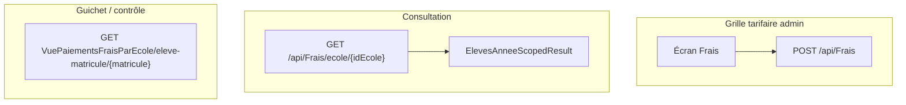

# Intégration Vue 3 & Flutter — module Frais (année scolaire + classe)

Guide d'intégration pour la **grille tarifaire** et la **consultation des barèmes** côté **Vue 3** (web admin) et **Flutter** (mobile / tablette).

**Références API :**
- [DOCUMENTATION_FRONTEND_ROLE_CAISSIER.md](DOCUMENTATION_FRONTEND_ROLE_CAISSIER.md) — guichet, solde élève
- [DOCUMENTATION_INTEGRATION_FRONTEND_CAISSIER_VUE_FLUTTER.md](DOCUMENTATION_INTEGRATION_FRONTEND_CAISSIER_VUE_FLUTTER.md) — écran guichet Vue/Flutter
- [DOCUMENTATION_FRONTEND_ROLE_CONTROLEUR.md](DOCUMENTATION_FRONTEND_ROLE_CONTROLEUR.md) — contrôle entrée, lecture frais
- [DOCUMENTATION_BULK_INSERT_PAIEMENTS.md](DOCUMENTATION_BULK_INSERT_PAIEMENTS.md) — import Excel paiements
- [DOCUMENTATION_FRONTEND_REINSCRIPTION.md](DOCUMENTATION_FRONTEND_REINSCRIPTION.md) — wrapper `ElevesAnneeScopedResult`

**Base URL dev :** `https://localhost:7102` ou `https://dev-knb.asdc-rdc.org`  
**Swagger :** `/swagger/index.html`  
**Auth :** `Authorization: Bearer {jwt_token}`

**Note ops :** migration prod portée Frais — [Scripts/BACKFILL_FRAIS_PORTEE.sql](Scripts/BACKFILL_FRAIS_PORTEE.sql) et EF `20260903120000_FraisPorteeDirectionsClasses`. Ancien backfill année : [Scripts/BACKFILL_FRAIS_ANNEE_SCOLAIRE.sql](Scripts/BACKFILL_FRAIS_ANNEE_SCOLAIRE.sql).

---

## Table des matières

1. [Vue d'ensemble métier](#1-vue-densemble-métier)
2. [Breaking changes / migration front](#2-breaking-changes--migration-front)
3. [Authentification et permissions](#3-authentification-et-permissions)
4. [Endpoints API](#4-endpoints-api)
5. [Modèle Frais et wrapper](#5-modèle-frais-et-wrapper)
6. [Règles UI admin (grille tarifaire)](#6-règles-ui-admin-grille-tarifaire)
7. [Vue 3 — types TypeScript](#7-vue-3--types-typescript)
8. [Vue 3 — service API](#8-vue-3--service-api)
9. [Vue 3 — composable useFraisGrille](#9-vue-3--composable-usefraisgrille)
10. [Vue 3 — écran exemple](#10-vue-3--écran-exemple)
11. [Flutter — modèles Dart](#11-flutter--modèles-dart)
12. [Flutter — FraisApiService](#12-flutter--fraisapiservice)
13. [Impacts écrans existants](#13-impacts-écrans-existants)
14. [Gestion des erreurs et checklist](#14-gestion-des-erreurs-et-checklist)

---

## 1. Vue d'ensemble métier

### Problème résolu

Avant le scoping **année + classe**, un frais était rattaché uniquement à une **direction**. Impossible de :
- avoir des grilles tarifaires **différentes par année scolaire** ;
- appliquer un montant **spécifique à une classe** (ex. minerval 6e ≠ minerval 5e) tout en gardant des frais **communs à toute la direction** (ex. inscription).

### Modèle actuel

| Champ | Obligatoire | Signification |
|-------|-------------|---------------|
| `idEcole` | Oui | École du barème |
| `idAnneeScolaire` | Oui | Une ligne de barème = **une année** |
| `portee` | Oui | `1` = Direction, `2` = Classe (XOR) |
| `directions` | Si portee Direction | Liste des directions concernées |
| `classes` | Si portee Classe | Liste des classes concernées |

Un frais a **soit** `idDirections[]`, **soit** `idClasses[]` — jamais les deux. Toute une direction = une ligne + une entrée dans `directions`. Plusieurs classes (ex. 6e A et 6e B) = une ligne + plusieurs `classes`.

### Exemples concrets

| Libellé | Portée | Qui paie ? |
|---------|--------|------------|
| Inscription | Direction `[Primaire]` | Tous les élèves de cette direction |
| Transport | Classe `[6e A, 6e B]` | Uniquement ces classes |
| Minerval | Classe `[10]` | Uniquement la classe 10 |

### Éligibilité côté backend

Lors d'un paiement ou d'un calcul de solde, le backend filtre via `FraisEligibility` :

```
frais.statut && frais.idEcole && frais.idAnneeScolaire
&& (
  portee Classe && classe élève ∈ frais.classes
  || portee Direction && direction élève ∈ frais.directions
)
```

Le front **ne doit pas** filtrer manuellement sur `V_Eleve.IdClasse` pour les barèmes — utiliser les endpoints Frais avec `idClasse` ou `VuePaiementsFraisParEcole` pour le solde.



---

## 2. Breaking changes / migration front

### Tableau avant / après

| Aspect | Avant | Après |
|--------|-------|-------|
| Modèle `Frais` | 1 direction + 0..1 classe | `idEcole` + `portee` XOR (`directions[]` **ou** `classes[]`) |
| `GET /api/Frais/ecole/{idEcole}` | Tableau `Frais[]` | `{ data: FraisDto[], idEcole, idAnneeScolaire }` |
| `POST /api/Frais` | `idDirection` + `idClasse?` | `idEcole`, `portee`, `idDirections[]` **ou** `idClasses[]` |
| `PUT /api/Frais/{id}` | DTO sans portée | `portee` + listes optionnelles (remplace la portée si fournies) |
| `GET /api/Frais/ecole/{idEcole}/libelle` | Objet `Frais` ou 404 | Wrapper `{ data: Frais \| null, idEcole, idAnneeScolaire }` |
| `GET /api/Frais/direction/{idDirection}` | Tableau | Wrapper identique |
| Query params liste | Aucun | `idAnneeScolaire?`, `idClasse?` |
| `POST /api/Frais` | Sans année explicite | `idAnneeScolaire <= 0` → année **courante** auto |
| `PUT /api/Frais/{id}` | Corps `Frais` complet | DTO [`UpdateFraisDto`](Models/DTOs/UpdateFraisDto.cs) (`portee` + listes si changement de portée) |

### Actions migration front

1. **Parser le wrapper** — ne plus traiter la réponse liste comme un tableau racine.
2. **Conserver `idAnneeScolaire` résolu** — afficher l'année active dans l'UI (badge, sélecteur).
3. **Formulaire création** — `idEcole`, `idAnneeScolaire` (ou `0`), `portee` (1\|2), puis **multi-select** `idDirections[]` **ou** `idClasses[]`.
4. **Listes guichet** — si vous chargez `/api/Frais/ecole/...` pour peupler un select, passer `idClasse` de l'élève quand connu.
5. **Solde élève** — `VuePaiementsFraisParEcole` reste la source recommandée ; pas de changement obligatoire si déjà utilisé.

---

## 3. Authentification et permissions

### Headers

```http
Authorization: Bearer {jwt_token}
Accept: application/json
Content-Type: application/json
```

### Claims JWT utiles

| Claim | Usage |
|-------|-------|
| `idEcole` | Filtrage multi-tenant ; `GET /api/Frais/ecole/{idEcole}` vérifie l'école JWT |
| `role` | Admin, Financier, Caissier, Controleur, … |

### Permissions RBAC

| Permission | Action |
|------------|--------|
| `Frais.Read` | Voir un frais (`GET {id}`) |
| `Frais.ReadAll` | Listes école / direction |
| `Frais.Create` | `POST /api/Frais` |
| `Frais.Update` | `PUT`, `toggle-statut` |
| `Frais.Delete` | `DELETE` |

### Matrice rôles (résumé)

| Rôle | CRUD grille | Liste barèmes | Encaissement |
|------|-------------|---------------|--------------|
| Admin / Financier | ✅ | ✅ | ✅ |
| Directeur | Partiel (selon permissions) | ✅ | Supervision |
| Caissier | ❌ | ✅ lecture | ✅ |
| Controleur | ❌ | ✅ lecture | ❌ |

`PUT /api/Frais/{id}` exige en plus le rôle JWT **`Admin`** ou **`Super-Admin`** (couche `[Authorize(Roles = ...)]`).

---

## 4. Endpoints API

### 4.1 Liste par école (principal)

```
GET /api/Frais/ecole/{idEcole}?idAnneeScolaire=&idClasse=
```

| Paramètre | Type | Description |
|-----------|------|-------------|
| `idEcole` | path | École (doit correspondre au JWT sauf Super-Admin) |
| `idAnneeScolaire` | query, opt. | Année cible ; défaut = **année courante** |
| `idClasse` | query, opt. | Si fourni : frais dont la portée couvre cette classe (direction de la classe **ou** classe listée) |

**Réponse `200` :**

```json
{
  "data": [
    {
      "idFrais": 1,
      "libelleFrais": "Inscription",
      "montant": 50,
      "devise": "USD",
      "idEcole": 1,
      "idAnneeScolaire": 100,
      "portee": 1,
      "directions": [{ "idDirection": 1, "nomDirection": "Primaire" }],
      "classes": []
    },
    {
      "idFrais": 2,
      "libelleFrais": "Minerval 6e",
      "montant": 100,
      "devise": "USD",
      "typeFrais": "Scolaires",
      "periodicite": "Annuel",
      "description": null,
      "statut": true,
      "idEcole": 1,
      "idAnneeScolaire": 100,
      "portee": 2,
      "directions": [],
      "classes": [{ "idClasse": 10, "nomClasse": "6e A", "idDirection": 1 }]
    }
  ],
  "idEcole": 1,
  "idAnneeScolaire": 100
}
```

**Erreurs :** `403` école JWT ; `400` année introuvable.

---

### 4.2 Recherche par libellé

```
GET /api/Frais/ecole/{idEcole}/libelle?libelleFrais={texte}&idAnneeScolaire=&idClasse=
```

Résolution du libellé (insensible à la casse) :

- Si `idClasse` fourni → frais éligible pour cette inscription (classe listée, sinon direction).
- Sinon → priorité portée Direction.

**Réponse `200` :** wrapper avec `data` = un seul `Frais` ou `null`.  
**Réponse `404` :** aucun frais pour ce libellé.

---

### 4.3 Liste par direction

```
GET /api/Frais/direction/{idDirection}?idAnneeScolaire=&idClasse=
```

Même logique de filtre année + classe. Retourne le wrapper `ElevesAnneeScopedResult`.

---

### 4.4 Liste par année (sans wrapper)

```
GET /api/Frais/annee/{idAnneeScolaire}
```

Retourne directement `Frais[]` (toutes directions, toutes classes de cette année).

---

### 4.5 Détail, existence

```
GET /api/Frais/{id}
GET /api/Frais/exists/{id}
```

---

### 4.6 Création

```
POST /api/Frais
Permission: Frais.Create
```

**Corps :**

```json
{
  "libelleFrais": "Transport",
  "montant": 30,
  "devise": "USD",
  "typeFrais": "Transport",
  "periodicite": "Mensuel",
  "description": "Bus scolaire",
  "idEcole": 1,
  "idAnneeScolaire": 0,
  "portee": 2,
  "idClasses": [10, 11],
  "statut": true
}
```

`portee` : `1` = Direction (`idDirections` requis), `2` = Classe (`idClasses` requis). `idAnneeScolaire` ≤ 0 → année courante.

| Règle | Comportement |
|-------|--------------|
| `idAnneeScolaire <= 0` | Résolu sur **année courante** de `idEcole` |
| `portee = 1` | `idDirections` obligatoire, `idClasses` interdit |
| `portee = 2` | `idClasses` obligatoire, `idDirections` interdit |

**Réponse `201` :** frais créé avec `idFrais` assigné.

---

### 4.7 Mise à jour

```
PUT /api/Frais/{id}
Roles: Admin, Super-Admin
Permission: Frais.Update
```

**Corps (`UpdateFraisDto`) :**

```json
{
  "idFrais": 2,
  "libelleFrais": "Minerval 6e",
  "montant": 110,
  "devise": "USD",
  "typeFrais": "Scolaires",
  "periodicite": "Annuel",
  "description": null,
  "idAnneeScolaire": 100,
  "portee": 2,
  "idClasses": [10]
}
```

- `idAnneeScolaire` : appliqué seulement si `> 0`.
- Si `portee` **ou** `idDirections` **ou** `idClasses` est fourni, la portée est **remplacée** (XOR : une liste, l'autre vide).
- Pour passer de classes à « toute la direction » : `portee: 1` + `idDirections: [id]`.

---

### 4.8 Toggle statut / suppression

```
PUT /api/Frais/toggle-statut/{id}
DELETE /api/Frais/{id}
```

Toggle retourne `{ message, nouveauStatut, frais }`.

---

## 5. Modèle Frais et wrapper

### Interface TypeScript (référence)

```typescript
export interface FraisDirectionItem {
  idDirection: number;
  nomDirection?: string | null;
}

export interface FraisClasseItem {
  idClasse: number;
  nomClasse?: string | null;
  idDirection?: number | null;
}

export interface Frais {
  idFrais: number;
  libelleFrais: string;
  montant: number;
  devise: string;
  typeFrais?: string | null;
  periodicite?: string | null;
  description?: string | null;
  statut?: boolean | null;
  idEcole: number;
  nomEcole?: string | null;
  idAnneeScolaire: number;
  libelleAnneeScolaire?: string | null;
  portee: 1 | 2; // 1 Direction, 2 Classe
  directions: FraisDirectionItem[];
  classes: FraisClasseItem[];
}

export interface CreateFraisDto {
  libelleFrais: string;
  montant: number;
  devise: string;
  idEcole: number;
  idAnneeScolaire: number;
  portee: 1 | 2;
  idDirections?: number[];
  idClasses?: number[];
}

export interface UpdateFraisDto {
  idFrais: number;
  libelleFrais: string;
  montant: number;
  devise?: string | null;
  typeFrais?: string | null;
  periodicite?: string | null;
  description?: string | null;
  idAnneeScolaire?: number | null;
  portee?: 1 | 2;
  idDirections?: number[];
  idClasses?: number[];
}

export interface ElevesAnneeScopedResult<T> {
  data: T;
  idEcole: number;
  idAnneeScolaire: number;
}
```

### Labels UI suggérés

| `portee` | Affichage liste |
|----------|-----------------|
| `1` | Noms dans `directions` (ex. « Primaire, Maternelle ») |
| `2` | Noms dans `classes` (ex. « 6e A, 6e B ») |

---

## 6. Règles UI admin (grille tarifaire)

### Écran liste

1. **Sélecteur année scolaire** — défaut année courante ; recharger la liste à chaque changement.
2. **Filtre direction** (optionnel côté client si liste complète) ou appeler `/direction/{id}`.
3. **Filtre classe** (optionnel) — pour prévisualiser ce qu'un élève de cette classe verrait.
4. Colonnes : libellé, montant, devise, direction, portée (direction / classe), statut.

### Formulaire création / édition

| Champ | Widget | Validation front |
|-------|--------|------------------|
| Libellé | Input text | Requis, max 200 |
| Montant | Number | >= 0 |
| Devise | Select | USD, CDF, … |
| École | Select / JWT | Requis (`idEcole`) |
| Année | Select | Requis ; défaut année courante (`0`) |
| Portée | Radio / select | `1` Direction **ou** `2` Classe |
| Directions | Multi-select | Requis si portée Direction ; mêmes école |
| Classes | Multi-select | Requis si portée Classe ; mêmes école, n'importe quelle direction |
| Type / Périodicité | Select | Valeurs métier |

### Duplication année N → N+1

Workflow recommandé (non automatisé côté API v1) :

1. Charger `GET /api/Frais/ecole/{idEcole}?idAnneeScolaire={N}`.
2. Pour chaque ligne, `POST` avec `idAnneeScolaire={N+1}` et mêmes champs.
3. Ajuster montants manuellement si besoin.

### Anti-patterns

- Ne pas créer deux frais direction-wide avec le **même libellé** même année (confusion import Excel / guichet).
- Ne pas envoyer `idDirections` et `idClasses` ensemble (XOR, 400).
- Ne pas mélanger des `idAnneeScolaire` d'une autre école (validation backend → 400).

---

## 7. Vue 3 — types TypeScript

Fichier suggéré : `src/types/frais.ts`

```typescript
// src/types/frais.ts
export interface FraisDirectionItem {
  idDirection: number;
  nomDirection?: string | null;
}
export interface FraisClasseItem {
  idClasse: number;
  nomClasse?: string | null;
  idDirection?: number | null;
}
export interface Frais {
  idFrais: number;
  libelleFrais: string;
  montant: number;
  devise: string;
  typeFrais?: string | null;
  periodicite?: string | null;
  description?: string | null;
  statut?: boolean | null;
  idEcole: number;
  idAnneeScolaire: number;
  portee: 1 | 2;
  directions: FraisDirectionItem[];
  classes: FraisClasseItem[];
}

export interface CreateFraisDto {
  libelleFrais: string;
  montant: number;
  devise: string;
  idEcole: number;
  idAnneeScolaire: number;
  portee: 1 | 2;
  idDirections?: number[];
  idClasses?: number[];
}

export interface UpdateFraisDto {
  idFrais: number;
  libelleFrais: string;
  montant: number;
  devise?: string | null;
  typeFrais?: string | null;
  periodicite?: string | null;
  description?: string | null;
  idAnneeScolaire?: number | null;
  portee?: 1 | 2;
  idDirections?: number[];
  idClasses?: number[];
}

export interface ElevesAnneeScopedResult<T> {
  data: T;
  idEcole: number;
  idAnneeScolaire: number;
}

export interface FraisListFilters {
  idEcole: number;
  idAnneeScolaire?: number;
  idClasse?: number;
}

export type FraisScopeLabel = 'direction' | 'classe';

export function fraisScopeLabel(frais: Frais): FraisScopeLabel {
  return frais.portee === 2 ? 'classe' : 'direction';
}
```

---

## 8. Vue 3 — service API

Fichier suggéré : `src/api/fraisApi.js`

```javascript
// src/api/fraisApi.js
import { apiFetch } from './client';

function buildQuery(params = {}) {
  const qs = new URLSearchParams();
  Object.entries(params).forEach(([k, v]) => {
    if (v !== undefined && v !== null && v !== '') qs.set(k, String(v));
  });
  const s = qs.toString();
  return s ? `?${s}` : '';
}

/**
 * Liste frais école (wrapper année scopée).
 * @param {number} idEcole
 * @param {{ idAnneeScolaire?: number, idClasse?: number }} [filters]
 * @returns {Promise<import('../types/frais').ElevesAnneeScopedResult<import('../types/frais').Frais[]>>}
 */
export function fetchFraisByEcole(idEcole, { idAnneeScolaire, idClasse } = {}) {
  const qs = buildQuery({ idAnneeScolaire, idClasse });
  return apiFetch(`/api/Frais/ecole/${idEcole}${qs}`);
}

/**
 * Liste frais direction.
 */
export function fetchFraisByDirection(idDirection, { idAnneeScolaire, idClasse } = {}) {
  const qs = buildQuery({ idAnneeScolaire, idClasse });
  return apiFetch(`/api/Frais/direction/${idDirection}${qs}`);
}

/**
 * Recherche par libellé (résolution classe prioritaire).
 */
export function fetchFraisByLibelle(idEcole, libelleFrais, { idAnneeScolaire, idClasse } = {}) {
  const qs = buildQuery({ libelleFrais, idAnneeScolaire, idClasse });
  return apiFetch(`/api/Frais/ecole/${idEcole}/libelle${qs}`);
}

/** @returns {Promise<import('../types/frais').Frais>} */
export function fetchFraisById(idFrais) {
  return apiFetch(`/api/Frais/${idFrais}`);
}

/** @returns {Promise<import('../types/frais').Frais>} */
export function createFrais(payload) {
  return apiFetch('/api/Frais', { method: 'POST', body: JSON.stringify(payload) });
}

/** @returns {Promise<import('../types/frais').Frais>} */
export function updateFrais(idFrais, dto) {
  return apiFetch(`/api/Frais/${idFrais}`, { method: 'PUT', body: JSON.stringify(dto) });
}

export function toggleFraisStatut(idFrais) {
  return apiFetch(`/api/Frais/toggle-statut/${idFrais}`, { method: 'PUT' });
}

export function deleteFrais(idFrais) {
  return apiFetch(`/api/Frais/${idFrais}`, { method: 'DELETE' });
}
```

---

## 9. Vue 3 — composable useFraisGrille

Fichier suggéré : `src/composables/useFraisGrille.js`

```javascript
// src/composables/useFraisGrille.js
import { ref, computed, watch } from 'vue';
import { fetchFraisByEcole } from '@/api/fraisApi';
import { useAuthStore } from '@/stores/auth';

const cache = new Map();

function cacheKey(idEcole, idAnneeScolaire, idClasse) {
  return `${idEcole}|${idAnneeScolaire ?? ''}|${idClasse ?? ''}`;
}

export function useFraisGrille(options = {}) {
  const auth = useAuthStore();
  const idEcole = computed(() => options.idEcole?.value ?? auth.idEcole);

  const idAnneeScolaire = ref(options.idAnneeScolaire ?? null);
  const idClasse = ref(options.idClasse ?? null);
  const resolvedAnnee = ref(null);
  const frais = ref([]);
  const loading = ref(false);
  const error = ref(null);

  const fraisActifs = computed(() =>
    frais.value.filter(f => f.statut !== false)
  );

  const fraisDirectionWide = computed(() =>
    fraisActifs.value.filter(f => f.portee === 1)
  );

  const fraisParClasse = computed(() => {
    const map = new Map();
    fraisActifs.value
      .filter(f => f.portee === 2)
      .forEach(f => {
        for (const c of f.classes ?? []) {
          map.set(c.idClasse, [...(map.get(c.idClasse) ?? []), f]);
        }
      });
    return map;
  });

  async function load(force = false) {
    if (!idEcole.value) return;
    loading.value = true;
    error.value = null;
    const key = cacheKey(idEcole.value, idAnneeScolaire.value, idClasse.value);

    try {
      if (!force && cache.has(key)) {
        const cached = cache.get(key);
        frais.value = cached.data;
        resolvedAnnee.value = cached.idAnneeScolaire;
        return;
      }

      const result = await fetchFraisByEcole(idEcole.value, {
        idAnneeScolaire: idAnneeScolaire.value ?? undefined,
        idClasse: idClasse.value ?? undefined
      });

      frais.value = result.data ?? [];
      resolvedAnnee.value = result.idAnneeScolaire;
      idAnneeScolaire.value = result.idAnneeScolaire;
      cache.set(key, { data: frais.value, idAnneeScolaire: result.idAnneeScolaire });
    } catch (e) {
      error.value = e.message ?? 'Erreur chargement frais';
      frais.value = [];
    } finally {
      loading.value = false;
    }
  }

  function invalidateCache() {
    cache.clear();
  }

  watch([idEcole, idAnneeScolaire, idClasse], () => load(), { immediate: true });

  return {
    idEcole,
    idAnneeScolaire,
    idClasse,
    resolvedAnnee,
    frais,
    fraisActifs,
    fraisDirectionWide,
    fraisParClasse,
    loading,
    error,
    load,
    invalidateCache
  };
}
```

---

## 10. Vue 3 — écran exemple

### Liste + formulaire (extrait)

```vue
<!-- src/views/admin/FraisGrilleView.vue -->
<script setup>
import { ref } from 'vue';
import { useFraisGrille } from '@/composables/useFraisGrille';
import { createFrais, updateFrais, toggleFraisStatut } from '@/api/fraisApi';

const {
  fraisActifs, loading, error, idAnneeScolaire, resolvedAnnee, load, invalidateCache
} = useFraisGrille();

const form = ref({
  libelleFrais: '',
  montant: 0,
  devise: 'USD',
  idEcole: null,
  idAnneeScolaire: 0,
  portee: 1,
  idDirections: [],
  idClasses: [],
  typeFrais: 'Scolaires',
  periodicite: 'Annuel'
});

async function onSubmit() {
  await createFrais({ ...form.value, statut: true });
  invalidateCache();
  await load(true);
}

async function onToggle(f) {
  await toggleFraisStatut(f.idFrais);
  invalidateCache();
  await load(true);
}
</script>

<template>
  <div class="frais-grille">
    <header>
      <h1>Grille tarifaire</h1>
      <span v-if="resolvedAnnee" class="badge">Année #{{ resolvedAnnee }}</span>
    </header>

    <p v-if="loading">Chargement…</p>
    <p v-else-if="error" class="error">{{ error }}</p>

    <table v-else>
      <thead>
        <tr>
          <th>Libellé</th>
          <th>Montant</th>
          <th>Portée</th>
          <th></th>
        </tr>
      </thead>
      <tbody>
        <tr v-for="f in fraisActifs" :key="f.idFrais">
          <td>{{ f.libelleFrais }}</td>
          <td>{{ f.montant }} {{ f.devise }}</td>
          <td>{{ f.portee === 2 ? (f.classes || []).map(c => c.nomClasse).join(', ') : (f.directions || []).map(d => d.nomDirection).join(', ') }}</td>
          <td><button type="button" @click="onToggle(f)">Activer/Désactiver</button></td>
        </tr>
      </tbody>
    </table>

    <!-- formulaire création simplifié -->
    <form @submit.prevent="onSubmit">
      <input v-model="form.libelleFrais" placeholder="Libellé" required />
      <input v-model.number="form.montant" type="number" min="0" step="0.01" required />
      <!-- portée + multi-select directions XOR classes ; année : selects alimentés par APIs existantes -->
      <button type="submit">Créer</button>
    </form>
  </div>
</template>
```

### Route admin suggérée

```javascript
{
  path: '/admin/frais',
  name: 'admin-frais',
  component: () => import('@/views/admin/FraisGrilleView.vue'),
  meta: { requiresAuth: true, permissions: ['Frais.ReadAll'] }
}
```

---

## 11. Flutter — modèles Dart

Fichier suggéré : `lib/models/frais.dart`

```dart
// lib/models/frais.dart
class FraisDirectionItem {
  final int idDirection;
  final String? nomDirection;
  const FraisDirectionItem({required this.idDirection, this.nomDirection});
  factory FraisDirectionItem.fromJson(Map<String, dynamic> json) =>
      FraisDirectionItem(
        idDirection: json['idDirection'] as int,
        nomDirection: json['nomDirection'] as String?,
      );
}

class FraisClasseItem {
  final int idClasse;
  final String? nomClasse;
  final int? idDirection;
  const FraisClasseItem({
    required this.idClasse,
    this.nomClasse,
    this.idDirection,
  });
  factory FraisClasseItem.fromJson(Map<String, dynamic> json) => FraisClasseItem(
        idClasse: json['idClasse'] as int,
        nomClasse: json['nomClasse'] as String?,
        idDirection: json['idDirection'] as int?,
      );
}

class Frais {
  final int idFrais;
  final String libelleFrais;
  final double montant;
  final String devise;
  final String? typeFrais;
  final String? periodicite;
  final String? description;
  final bool? statut;
  final int idEcole;
  final int idAnneeScolaire;
  final int portee;
  final List<FraisDirectionItem> directions;
  final List<FraisClasseItem> classes;

  const Frais({
    required this.idFrais,
    required this.libelleFrais,
    required this.montant,
    required this.devise,
    this.typeFrais,
    this.periodicite,
    this.description,
    this.statut,
    required this.idEcole,
    required this.idAnneeScolaire,
    required this.portee,
    this.directions = const [],
    this.classes = const [],
  });

  factory Frais.fromJson(Map<String, dynamic> json) => Frais(
        idFrais: json['idFrais'] as int,
        libelleFrais: json['libelleFrais'] as String,
        montant: (json['montant'] as num).toDouble(),
        devise: json['devise'] as String? ?? 'USD',
        typeFrais: json['typeFrais'] as String?,
        periodicite: json['periodicite'] as String?,
        description: json['description'] as String?,
        statut: json['statut'] as bool?,
        idEcole: json['idEcole'] as int,
        idAnneeScolaire: json['idAnneeScolaire'] as int,
        portee: json['portee'] as int,
        directions: (json['directions'] as List<dynamic>? ?? [])
            .map((e) => FraisDirectionItem.fromJson(e as Map<String, dynamic>))
            .toList(),
        classes: (json['classes'] as List<dynamic>? ?? [])
            .map((e) => FraisClasseItem.fromJson(e as Map<String, dynamic>))
            .toList(),
      );

  Map<String, dynamic> toCreateJson() => {
        'libelleFrais': libelleFrais,
        'montant': montant,
        'devise': devise,
        'typeFrais': typeFrais,
        'periodicite': periodicite,
        'description': description,
        'idEcole': idEcole,
        'idAnneeScolaire': idAnneeScolaire,
        'portee': portee,
        if (portee == 1)
          'idDirections': directions.map((d) => d.idDirection).toList(),
        if (portee == 2) 'idClasses': classes.map((c) => c.idClasse).toList(),
        'statut': statut ?? true,
      };

  bool get isDirectionWide => portee == 1;
}

class ElevesAnneeScopedResult<T> {
  final T data;
  final int idEcole;
  final int idAnneeScolaire;

  ElevesAnneeScopedResult({
    required this.data,
    required this.idEcole,
    required this.idAnneeScolaire,
  });

  factory ElevesAnneeScopedResult.listFrais(Map<String, dynamic> json) {
    final list = (json['data'] as List<dynamic>? ?? [])
        .map((e) => Frais.fromJson(e as Map<String, dynamic>))
        .toList();
    return ElevesAnneeScopedResult(
      data: list,
      idEcole: json['idEcole'] as int,
      idAnneeScolaire: json['idAnneeScolaire'] as int,
    );
  }
}

class UpdateFraisDto {
  final int idFrais;
  final String libelleFrais;
  final double montant;
  final String? devise;
  final int? idAnneeScolaire;
  final int? portee;
  final List<int>? idDirections;
  final List<int>? idClasses;

  UpdateFraisDto({
    required this.idFrais,
    required this.libelleFrais,
    required this.montant,
    this.devise,
    this.idAnneeScolaire,
    this.portee,
    this.idDirections,
    this.idClasses,
  });

  Map<String, dynamic> toJson() => {
        'idFrais': idFrais,
        'libelleFrais': libelleFrais,
        'montant': montant,
        if (devise != null) 'devise': devise,
        if (idAnneeScolaire != null) 'idAnneeScolaire': idAnneeScolaire,
        if (portee != null) 'portee': portee,
        if (idDirections != null) 'idDirections': idDirections,
        if (idClasses != null) 'idClasses': idClasses,
      };
}
```

---

## 12. Flutter — FraisApiService

Fichier suggéré : `lib/services/frais_api_service.dart`

```dart
// lib/services/frais_api_service.dart
import 'dart:convert';
import '../core/api_client.dart';
import '../models/frais.dart';

class FraisApiService {
  FraisApiService(this._client);
  final ApiClient _client;

  Future<ElevesAnneeScopedResult<List<Frais>>> fetchByEcole(
    int idEcole, {
    int? idAnneeScolaire,
    int? idClasse,
  }) async {
    final params = <String, String>{};
    if (idAnneeScolaire != null) params['idAnneeScolaire'] = '$idAnneeScolaire';
    if (idClasse != null) params['idClasse'] = '$idClasse';
    final qs = params.isEmpty ? '' : '?${Uri(queryParameters: params).query}';

    final res = await _client.get('/api/Frais/ecole/$idEcole$qs');
    return ElevesAnneeScopedResult.listFrais(
      jsonDecode(res.body) as Map<String, dynamic>,
    );
  }

  Future<Frais> create(Frais frais) async {
    final res = await _client.post(
      '/api/Frais',
      body: jsonEncode(frais.toCreateJson()),
    );
    return Frais.fromJson(jsonDecode(res.body) as Map<String, dynamic>);
  }

  Future<Frais> update(int id, UpdateFraisDto dto) async {
    final res = await _client.put(
      '/api/Frais/$id',
      body: jsonEncode(dto.toJson()),
    );
    return Frais.fromJson(jsonDecode(res.body) as Map<String, dynamic>);
  }

  Future<void> toggleStatut(int idFrais) async {
    await _client.put('/api/Frais/toggle-statut/$idFrais');
  }
}
```

### Provider exemple

```dart
// lib/providers/frais_grille_provider.dart
class FraisGrilleProvider extends ChangeNotifier {
  FraisGrilleProvider(this._api);
  final FraisApiService _api;

  List<Frais> _frais = [];
  int? _resolvedAnnee;
  bool loading = false;
  String? error;

  List<Frais> get frais => _frais;
  int? get resolvedAnnee => _resolvedAnnee;

  Future<void> load(int idEcole, {int? idAnneeScolaire, int? idClasse}) async {
    loading = true;
    error = null;
    notifyListeners();
    try {
      final result = await _api.fetchByEcole(
        idEcole,
        idAnneeScolaire: idAnneeScolaire,
        idClasse: idClasse,
      );
      _frais = result.data;
      _resolvedAnnee = result.idAnneeScolaire;
    } catch (e) {
      error = e.toString();
      _frais = [];
    } finally {
      loading = false;
      notifyListeners();
    }
  }
}
```

---

## 13. Impacts écrans existants

### Guichet (Caissier)

| Besoin | Endpoint | Changement |
|--------|----------|------------|
| Solde / reste à payer | `GET /api/VuePaiementsFraisParEcole/eleve-matricule/{matricule}` | **Inchangé** — source principale |
| Select frais manuel | `GET /api/Frais/ecole/{idEcole}?idClasse={classeEleve}` | **Adapter** parser wrapper + query année/classe |

Voir [DOCUMENTATION_INTEGRATION_FRONTEND_CAISSIER_VUE_FLUTTER.md](DOCUMENTATION_INTEGRATION_FRONTEND_CAISSIER_VUE_FLUTTER.md).

### Contrôle à l'entrée (Controleur)

Consultation barèmes :

```
GET /api/Frais/ecole/{idEcole}
```

Année courante résolue automatiquement. Solde élève : toujours via `VuePaiementsFraisParEcole`.

Voir [DOCUMENTATION_INTEGRATION_FRONTEND_CONTROLEUR_VUE_FLUTTER.md](DOCUMENTATION_INTEGRATION_FRONTEND_CONTROLEUR_VUE_FLUTTER.md).

### Import Excel paiements

Le backend résout le libellé frais **par classe élève** (priorité frais classe, sinon direction-wide). Pas de changement front obligatoire sur l'upload.

Voir [DOCUMENTATION_BULK_INSERT_PAIEMENTS.md](DOCUMENTATION_BULK_INSERT_PAIEMENTS.md).

### Réinscription / inscription

Les frais éligibles à l'inscription suivent la même règle `FraisEligibility`. Le front inscription n'a pas besoin d'appeler `/api/Frais` si le guichet utilise la vue solde.

---

## 14. Gestion des erreurs et checklist

### Codes HTTP fréquents

| Code | Cause | Action UI |
|------|-------|-----------|
| `400` | Année introuvable, classe ∉ direction, année ∉ école | Toast message backend |
| `403` | `idEcole` ≠ JWT | Redirection / message accès refusé |
| `404` | Frais ou libellé introuvable | État vide |
| `401` | JWT expiré | Re-login |

### Messages validation backend (exemples)

- `Aucune année scolaire en cours pour l'école X. Précisez idAnneeScolaire…`
- `L'année scolaire doit appartenir à la même école que le frais.`
- `Toutes les directions / classes doivent appartenir à l'école du frais.`
- `Un frais de portée Direction ne peut pas lister des classes.`

### Checklist intégration

#### Migration breaking changes

- [ ] Remplacer parsing `Frais[]` racine par `result.data` sur les listes école/direction
- [ ] Afficher `idAnneeScolaire` résolu retourné par l'API
- [ ] Formulaire création : `idEcole`, `portee`, multi-select `idDirections` XOR `idClasses`
- [ ] `PUT` utilise `UpdateFraisDto` (plus le modèle complet si champs sensibles)

#### Grille admin

- [ ] Sélecteur année scolaire branché sur `GET /api/Frais/ecole/...`
- [ ] Portée classe vs direction visible dans la liste
- [ ] Duplication manuelle N→N+1 documentée pour les utilisateurs

#### Guichet / contrôle

- [ ] Solde via `VuePaiementsFraisParEcole` (recommandé)
- [ ] Si select frais brut : `?idClasse=` de l'inscription active

#### Tests manuels

- [ ] Liste sans param → année courante uniquement
- [ ] `?idClasse=10` → frais partagés + frais classe 10
- [ ] Création `idAnneeScolaire: 0` → année courante en base
- [ ] Création portée Classe avec classes d'une autre école → 400
- [ ] Création XOR (directions + classes) → 400
- [ ] Caissier : lecture OK, POST frais → 403

---

## Liens croisés

| Document | Sujet |
|----------|-------|
| [DOCUMENTATION_FRONTEND_ROLE_CAISSIER.md](DOCUMENTATION_FRONTEND_ROLE_CAISSIER.md) | Parcours guichet |
| [DOCUMENTATION_FRONTEND_ROLE_CONTROLEUR.md](DOCUMENTATION_FRONTEND_ROLE_CONTROLEUR.md) | Lecture frais contrôle entrée |
| [DOCUMENTATION_FRONTEND_REINSCRIPTION.md](DOCUMENTATION_FRONTEND_REINSCRIPTION.md) | Wrapper `ElevesAnneeScopedResult` |
| [DOCUMENTATION_ATTRIBUTION_ROLE_PERMISSIONS_ADMIN.md](DOCUMENTATION_ATTRIBUTION_ROLE_PERMISSIONS_ADMIN.md) | Permissions `Frais.*` |
