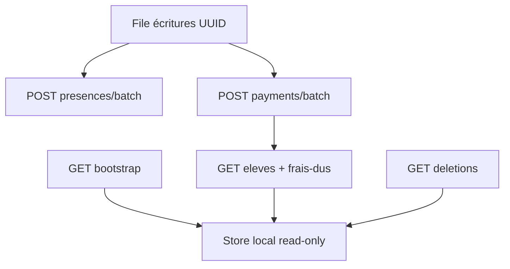

# Intégration Vue 3 & Flutter — Mode Offline / Sync

Guide d’intégration frontend pour le mode hors ligne KelasiNaBiso (lecture locale + file d’écritures idempotentes).

**Références :**
- [PORTABLE_INTEGRATION_OFFLINE_SYNC.md](PORTABLE_INTEGRATION_OFFLINE_SYNC.md) — contrat portable (vocabulaire clients / arrears)
- [DOCUMENTATION_INTEGRATION_FRONTEND_CONTROLEUR_VUE_FLUTTER.md](DOCUMENTATION_INTEGRATION_FRONTEND_CONTROLEUR_VUE_FLUTTER.md) — pointage Controleur
- [DOCUMENTATION_INTEGRATION_FRONTEND_CAISSIER_VUE_FLUTTER.md](DOCUMENTATION_INTEGRATION_FRONTEND_CAISSIER_VUE_FLUTTER.md) — encaissement Caissier

**Base URL dev :** `https://localhost:7102` (local) / `https://dev-knb.asdc-rdc.org`  
**Auth :** `Authorization: Bearer {jwt}`  
**JSON :** camelCase  
**Tenant :** claim JWT `IdEcole` / `idEcole` (pas de query `idEcole` sur `/api/sync/*`)

---

## Table des matières

1. [Périmètre](#1-périmètre)
2. [Endpoints](#2-endpoints)
3. [Cycle client recommandé](#3-cycle-client-recommandé)
4. [Contrats JSON](#4-contrats-json)
5. [Statuts batch](#5-statuts-batch)
6. [Vue 3 — client API](#6-vue-3--client-api)
7. [Flutter — Dio](#7-flutter--dio)
8. [Checklist](#8-checklist)

---

## 1. Périmètre

| Inclus | Exclu |
|--------|--------|
| Pull élèves + frais dus (année courante) | CRUD offline des fiches élèves / frais |
| Batch présences (élève XOR agent) | `PUT` présence offline |
| Batch paiements **CASH-like** | Moko / Mobile Money / Carte offline |
| Deletions / désactivations (purge cache) | Sync agents (option P1b, plus tard) |

**Permissions :**
- Pull / deletions : JWT valide + `IdEcole`
- `POST .../presences/batch` → `Presence.Create`
- `POST .../payments/batch` → `Paiement.Create`

**Rôles typiques :** Controleur (présences), Caissier / Financier (paiements).

---

## 2. Endpoints

| Méthode | Route | Rôle |
|---------|-------|------|
| `GET` | `/api/sync/bootstrap` | Snapshot initial (max 5000 / collection) |
| `GET` | `/api/sync/eleves` | Pages / delta élèves (`since`, `cursor`, `pageSize`, `snapshot`) |
| `GET` | `/api/sync/frais-dus` | Pages / delta soldes (`onlyOutstanding` défaut `true`) |
| `GET` | `/api/sync/deletions` | Purge — **`since` obligatoire** |
| `POST` | `/api/sync/presences/batch` | Upload pointages |
| `POST` | `/api/sync/payments/batch` | Upload encaissements CASH |

Aliases portables (masqués Swagger) : `/clients` → eleves, `/arrears` → frais-dus.

`pageSize` : défaut `1000`, max `5000`.

---

## 3. Cycle client recommandé



1. **Cold start** : `GET /bootstrap` → persister `eleves`, `fraisDus`, `watermark`, `snapshot`
2. Si `eleves` ou `fraisDus` saturés (5000) : enchaîner les pages `/eleves` et `/frais-dus`
3. **Online périodique** : pages avec `since` + `cursor` → mémoriser `nextSince`
4. **Purge** : `GET /deletions?since={watermark}` → retirer les IDs du store → mémoriser `nextSince`
5. **Offline** : créer des items en file avec `clientRequestId` UUID **figé à la création**
6. **Reconnect** : `POST .../batch` → traiter chaque `status` → re-sync `frais-dus` après paiements

**Invariant :** ne jamais régénérer un `clientRequestId` pour la même écriture.

---

## 4. Contrats JSON

### Bootstrap

```json
{
  "watermark": "2026-09-22T09:00:00.0000000Z_638...",
  "snapshot": "eco13_...",
  "idEcole": 13,
  "eleves": [ { "idEleve": 1, "matricule": "...", "nom": "...", "idClasse": 10, "nomClasse": "6e A", "isActif": true, "updatedAt": "..." } ],
  "fraisDus": [ { "idFrais": 5, "idEleve": 1, "libelle": "Minerval", "montantTotal": 100, "montantPaye": 40, "montantDu": 60, "codeDevise": "USD" } ]
}
```

### Page générique

```json
{
  "snapshot": "...",
  "items": [ ],
  "nextCursor": "2",
  "hasMore": true,
  "nextSince": "..."
}
```

- Cursor élèves : `IdEleve` (ex. `"42"`)
- Cursor frais dus : `IdEleve:IdFrais` (ex. `"1:5"`)

### Deletions

```http
GET /api/sync/deletions?since={watermark}&snapshot={snapshot}
```

```json
{
  "snapshot": "...",
  "deletedEleveIds": [50],
  "deactivatedEleveIds": [2, 3],
  "removedFraisIds": [9],
  "deletedPresenceIds": [],
  "deletedPaymentIds": [77],
  "nextSince": "..."
}
```

Actions locales :
- Retirer `deletedEleveIds` + `deactivatedEleveIds` du store élèves
- Retirer postes `removedFraisIds` (tous les `idEleve` liés à ce frais, ou re-sync frais-dus)
- Optionnel : purger `deletedPresenceIds` / `deletedPaymentIds`

**Limite connue :** pas de `UpdatedAt` natif — le soft-statut est aussi réconcilié (listes idempotentes). Les DELETE durs s’appuient sur `AuditLogs`.

### Batch présences

```json
{
  "items": [
    {
      "clientRequestId": "550e8400-e29b-41d4-a716-446655440000",
      "idEleve": 1,
      "isPresent": true,
      "heureArrivee": "07:30",
      "dateDuJour": "2026-09-22",
      "deviceId": "tablet-a"
    }
  ]
}
```

`idEleve` XOR `idAgent`. Double pointage le même jour → `rejected` / `ALREADY_POINTED`.

### Batch paiements

```json
{
  "items": [
    {
      "clientRequestId": "550e8400-e29b-41d4-a716-446655440001",
      "idEleve": 1,
      "idFrais": 5,
      "montantPaye": 40,
      "datePaiementUtc": "2026-09-22T08:15:00.000Z",
      "methodePaiement": "Espèces",
      "codeDevisePaiement": "USD",
      "deviceId": "pos-1"
    }
  ]
}
```

Autorisés : `Cash`, `Espèces`, `Chèque`, `Virement`.  
Moko / Mobile Money / Carte → `rejected` / `MOKO_NOT_ALLOWED`.

---

## 5. Statuts batch

| `status` | Action file locale |
|----------|-------------------|
| `created` | Succès — retirer de la file |
| `duplicate` | Déjà traité — retirer (idempotence OK) |
| `rejected` | Erreur métier — sortir + UX (`errorCode` / `message`) |
| `error` | Erreur technique — **garder** et retry |

Réponse type :

```json
{
  "results": [
    { "clientRequestId": "...", "status": "created", "idPaiement": 456, "newMontantDu": 60 }
  ],
  "summary": { "total": 1, "created": 1, "duplicates": 0, "rejected": 0, "errors": 0 }
}
```

Présences : champ `idPresence` à la place de `idPaiement`.

---

## 6. Vue 3 — client API

```ts
export const syncApi = {
  bootstrap: () => api.get('/api/sync/bootstrap'),
  eleves: (params?: { since?: string; cursor?: string; pageSize?: number; snapshot?: string }) =>
    api.get('/api/sync/eleves', { params }),
  fraisDus: (params?: {
    since?: string; cursor?: string; pageSize?: number; snapshot?: string; onlyOutstanding?: boolean
  }) => api.get('/api/sync/frais-dus', { params }),
  deletions: (params: { since: string; snapshot?: string }) =>
    api.get('/api/sync/deletions', { params }),
  presencesBatch: (items: Record<string, unknown>[]) =>
    api.post('/api/sync/presences/batch', { items }),
  paymentsBatch: (items: Record<string, unknown>[]) =>
    api.post('/api/sync/payments/batch', { items }),
}
```

---

## 7. Flutter — Dio

```dart
class SyncApi {
  SyncApi(this._dio);
  final Dio _dio;

  Future<Map<String, dynamic>> bootstrap() async {
    final r = await _dio.get('/api/sync/bootstrap');
    return r.data as Map<String, dynamic>;
  }

  Future<Map<String, dynamic>> eleves({String? since, String? cursor, int? pageSize, String? snapshot}) async {
    final r = await _dio.get('/api/sync/eleves', queryParameters: {
      if (since != null) 'since': since,
      if (cursor != null) 'cursor': cursor,
      if (pageSize != null) 'pageSize': pageSize,
      if (snapshot != null) 'snapshot': snapshot,
    });
    return r.data as Map<String, dynamic>;
  }

  Future<Map<String, dynamic>> fraisDus({
    String? since, String? cursor, int? pageSize, String? snapshot, bool onlyOutstanding = true,
  }) async {
    final r = await _dio.get('/api/sync/frais-dus', queryParameters: {
      if (since != null) 'since': since,
      if (cursor != null) 'cursor': cursor,
      if (pageSize != null) 'pageSize': pageSize,
      if (snapshot != null) 'snapshot': snapshot,
      'onlyOutstanding': onlyOutstanding,
    });
    return r.data as Map<String, dynamic>;
  }

  Future<Map<String, dynamic>> deletions({required String since, String? snapshot}) async {
    final r = await _dio.get('/api/sync/deletions', queryParameters: {
      'since': since,
      if (snapshot != null) 'snapshot': snapshot,
    });
    return r.data as Map<String, dynamic>;
  }

  Future<Map<String, dynamic>> presencesBatch(List<Map<String, dynamic>> items) async {
    final r = await _dio.post('/api/sync/presences/batch', data: {'items': items});
    return r.data as Map<String, dynamic>;
  }

  Future<Map<String, dynamic>> paymentsBatch(List<Map<String, dynamic>> items) async {
    final r = await _dio.post('/api/sync/payments/batch', data: {'items': items});
    return r.data as Map<String, dynamic>;
  }
}
```

Persistance locale (au choix de l’app) : store fiches + soldes, file d’écritures survivant au kill, indicateur online/offline.

---

## 8. Checklist

- [ ] JWT + claim `IdEcole` sur toutes les routes `/api/sync/*`
- [ ] Bootstrap au 1er lancement ; watermark persisté
- [ ] Delta via `since` + pagination `cursor` / `hasMore`
- [ ] Fiches = lecture seule offline
- [ ] File avec `clientRequestId` UUID stable
- [ ] Upload via `items` (pas `payments` / `presences` au top-level)
- [ ] Traitement des 4 `status`
- [ ] Purge via `deletions` (`since` obligatoire)
- [ ] Moko **exclu** de la file paiements
- [ ] Re-sync `frais-dus` après batch paiements réussi
- [ ] États loading / empty / error / « en attente de sync »

---

## Mapping vocabulaire portable

| Portable | KelasiNaBiso |
|----------|--------------|
| `clients` | `eleves` |
| `arrears` | `frais-dus` |
| `idClient` | `idEleve` |
| `idFacture` / poste | `idFrais` |
| `idSociete` | `idEcole` (JWT) |
