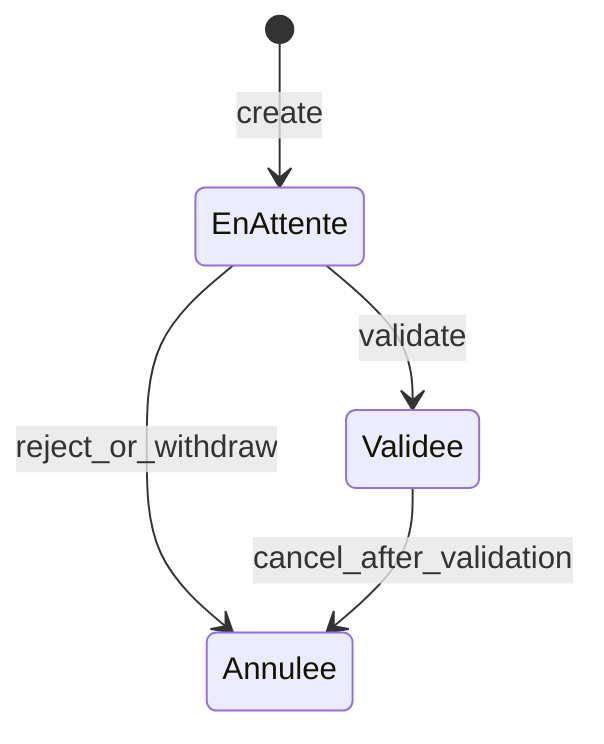

# Intégration portable — Module Dépenses

Guide **réutilisable hors métier énergie** : domaine, permissions, contrat HTTP et workflow pour intégrer ou réimplémenter un module de sorties d’argent.

- Auth : `Authorization: Bearer {jwt}`
- JSON : **camelCase**
- Ce document décrit le **noyau portable**. Les extensions liées à un métier précis (géographie, caisse, dashboards métier) sont isolées en **Annexe A**.

Références API métier (non portables) :

- [`API_DOCUMENTATION_DEPENSE.md`](./API_DOCUMENTATION_DEPENSE.md)
- [`FRONTEND_INTEGRATION_DEPENSE.md`](./FRONTEND_INTEGRATION_DEPENSE.md)

---

## 1. Domaine générique

| Concept portable | Champ / ressource API |
|------------------|------------------------|
| Organisation / tenant | `idSociete` |
| Dépense (sortie d’argent) | ressource `Depense` |
| Catégorie de dépense | ressource `CategorieDepense` |
| Créateur | `idUtilisateurCreateur`, `nomCreateur` |
| Validateur | `idUtilisateurValidateur`, `nomValidateur`, `dateValidation` |
| Statuts | `EnAttente` \| `Validee` \| `Annulee` |

### Invariants métier (à conserver partout)

| Règle | Conséquence |
|-------|-------------|
| Création → toujours `EnAttente` | Non comptabilisée dans les totaux / KPI |
| Seules les `Validee` comptent | Totaux, rapports, tableaux de bord |
| Montant **immuable** après création | Correction = annuler + recréer |
| Snapshot devise figé **à la validation** | Avant : `montant` + `codeDeviseMontant` ; après : aussi `montantDevisePrincipale` / `tauxVersDevisePrincipale` |
| Soft delete | Réservé aux capacités admin technique (`Depense.Delete`) |



| Statut | Comptabilisé |
|--------|--------------|
| `EnAttente` | Non |
| `Validee` | Oui |
| `Annulee` | Non |

---

## 2. Capacités par permission

Le front cible mappe **ses propres rôles** vers ces codes JWT. Ne pas hardcoder des noms de rôles métier dans le corps portable.

### Dépenses

| Permission | Capacité UI / API |
|------------|-------------------|
| `Depense.Read` | Détail |
| `Depense.ReadAll` | Liste paginée, rapport du mois |
| `Depense.Create` | Création (`EnAttente`) |
| `Depense.Update` | Modification si `EnAttente` ; annulation (retrait ou annulation post-validation selon règles serveur) |
| `Depense.Validate` | Valider / refuser |
| `Depense.Delete` | Soft delete |

### Catégories

| Permission | Capacité |
|------------|----------|
| `CategorieDepense.Read` | Détail |
| `CategorieDepense.ReadAll` | Liste par organisation |
| `CategorieDepense.Create` | Création |
| `CategorieDepense.Update` | Mise à jour (nom, description, actif) |
| `CategorieDepense.Delete` | Suppression / désactivation selon implémentation |

**Règle UI :** afficher un bouton seulement si la permission correspondante est présente dans le JWT (ou dans le profil utilisateur exposé).

---

## 3. Contrat HTTP — noyau

Base : `{API_BASE}/api/...`

### 3.1 Endpoints dépenses

| Méthode | Route | Permission | Description |
|---------|-------|------------|-------------|
| `GET` | `/api/Depense` | `Depense.ReadAll` | Liste paginée |
| `GET` | `/api/Depense/mois` | `Depense.ReadAll` | Rapport mois + `syntheseDepense` |
| `GET` | `/api/Depense/{id}` | `Depense.Read` | Détail |
| `POST` | `/api/Depense` | `Depense.Create` | Créer → `EnAttente` |
| `PUT` | `/api/Depense/{id}` | `Depense.Update` | Modifier si `EnAttente` (pas le montant) |
| `POST` | `/api/Depense/{id}/valider` | `Depense.Validate` | Valider |
| `POST` | `/api/Depense/{id}/refuser` | `Depense.Validate` | Refuser → `Annulee` |
| `POST` | `/api/Depense/{id}/annuler` | `Depense.Update` | Retrait / annulation |
| `DELETE` | `/api/Depense/{id}` | `Depense.Delete` | Soft delete → `204` |

### 3.2 Liste paginée — query

| Paramètre | Type | Description |
|-----------|------|-------------|
| `pageNumber`, `pageSize` | int | Pagination |
| `searchTerm` | string? | Recherche texte |
| `sortDescending` | bool | Tri |
| `idSociete` | int? | Filtre organisation (souvent réservé multi-tenant admin) |
| `dateDebut`, `dateFin` | datetime? | Période |
| `idCategorieDepense` | int? | Catégorie |
| `statut` | string? | `EnAttente` / `Validee` / `Annulee` |

Réponse `PagedResult` :

```json
{
  "data": [],
  "totalCount": 42,
  "pageNumber": 1,
  "pageSize": 20,
  "totalPages": 3,
  "hasPreviousPage": false,
  "hasNextPage": true
}
```

### 3.3 Rapport du mois

`GET /api/Depense/mois`

| Query | Défaut |
|-------|--------|
| `mois` | mois UTC courant (1–12) |
| `annee` | année UTC courante |
| `idSociete` | organisation du JWT (filtre admin multi-tenant possible) |
| `statut` | **`Validee`** |

Autres valeurs `statut` : `EnAttente`, `Annulee`, `Tous`.

Liste **non paginée**. `syntheseDepense` porte sur **les lignes affichées** (`montantTotal` = somme de ces lignes).

File d’attente validation :

```http
GET /api/Depense/mois?statut=EnAttente
```

Exemple réponse :

```json
{
  "mois": 8,
  "annee": 2026,
  "dateDebut": "2026-08-01T00:00:00Z",
  "dateFin": "2026-08-31T23:59:59.9999999Z",
  "depenses": [],
  "syntheseDepense": {
    "montantTotal": 150000,
    "nombreDepenses": 8,
    "nombreValidees": 8,
    "nombreEnAttente": 0
  }
}
```

### 3.4 Création / mise à jour / actions

**Création — champs noyau**

```json
POST /api/Depense
{
  "idSociete": 1,
  "idCategorieDepense": 2,
  "libelle": "Achat fournitures",
  "description": null,
  "beneficiaire": "Fournisseur X",
  "referencePiece": "FAC-2026-014",
  "montant": 150000,
  "codeDeviseMontant": "CDF",
  "modePaiement": "Espèces",
  "dateDepense": "2026-08-14T10:00:00Z"
}
```

Champs **extensions optionnelles** (ignorer si absents du métier cible) : `idCabine`, `idAxe`.

Réponse typique à la création : `statut: "EnAttente"`, `idUtilisateurValidateur: null`, pas de snapshot devise principale.

**Mise à jour** (`PUT`) : champs optionnels (libellé, description, bénéficiaire, référence, mode, date, catégorie, extensions). **Pas de `montant`.**

| Action | Body |
|--------|------|
| Valider | aucun |
| Refuser | `{ "motifAnnulation": "..." }` |
| Annuler | `{ "motifAnnulation": "..." }` |

### 3.5 Schéma réponse dépense (noyau)

| Champ | Notes |
|-------|-------|
| `idDepense`, `idSociete` | Identifiants |
| `idCategorieDepense`, `nomCategorie` | Catégorie |
| `libelle`, `description`, `beneficiaire`, `referencePiece` | Texte |
| `montant`, `codeDeviseMontant` | Montant saisi |
| `codeDevisePrincipale`, `tauxVersDevisePrincipale`, `montantDevisePrincipale` | Remplis à la validation (multi-devise) |
| `modePaiement`, `dateDepense`, `statut` | |
| `idUtilisateurCreateur`, `nomCreateur` | |
| `idUtilisateurValidateur`, `nomValidateur`, `dateValidation` | Null tant que `EnAttente` |
| `motifAnnulation`, `dateCreation` | |
| `idCabine`, `idAxe` | **Extension** — optionnels |

### 3.6 Endpoints catégories

| Méthode | Route | Permission |
|---------|-------|------------|
| `GET` | `/api/CategorieDepense/societe/{idSociete}` | `CategorieDepense.ReadAll` |
| `GET` | `/api/CategorieDepense/{id}` | `CategorieDepense.Read` |
| `POST` | `/api/CategorieDepense` | `CategorieDepense.Create` |
| `PUT` | `/api/CategorieDepense/{id}` | `CategorieDepense.Update` |
| `DELETE` | `/api/CategorieDepense/{id}` | `CategorieDepense.Delete` |

```json
POST /api/CategorieDepense
{
  "idSociete": 1,
  "nomCategorie": "Loyer",
  "description": "Loyer sites"
}
```

Réponse : `idCategorieDepense`, `idSociete`, `nomCategorie`, `description`, `statut` (bool actif), `dateCreation`.

---

## 4. Écrans recommandés (génériques)

1. **Liste** — `GET /api/Depense` + filtres statut / période / catégorie
2. **Rapport mois** — `GET /api/Depense/mois` ; carte `syntheseDepense.montantTotal`
3. **File d’attente** — `GET /api/Depense/mois?statut=EnAttente` + Valider / Refuser (`Depense.Validate`)
4. **Création** — catégories puis `POST /api/Depense` (si `Depense.Create`)
5. **Catégories** — CRUD si permissions `CategorieDepense.*`

Affichage montant (multi-devise optionnel) :

- Toujours : `montant` + `codeDeviseMontant`
- Si `statut === "Validee"` et `montantDevisePrincipale` renseigné avec devise différente : afficher aussi l’équivalent principal

---

## 5. Erreurs fréquentes

Corps typique : `{ "message": "..." }`

| HTTP | Cas | UI |
|------|-----|-----|
| 403 | Permission / rôle insuffisant | Masquer l’action |
| 400 | Statut incompatible (ex. valider une non-`EnAttente`) | Rafraîchir la ligne |
| 400 | `statut` query invalide | Corriger le filtre (`Validee`, `EnAttente`, `Annulee`, `Tous`) |
| 400 | Catégorie introuvable / inactive | Recharger les catégories |
| 404 | Dépense ou catégorie introuvable | Retour liste |

---

## 6. Checklist d’intégration (neutre)

- [ ] JWT transmis ; UI pilotée par permissions `Depense.*` / `CategorieDepense.*`
- [ ] Création → `EnAttente` ; absente du rapport mois par défaut (`statut=Validee`)
- [ ] Validation → apparaît dans `GET /mois` ; `syntheseDepense.montantTotal` augmente
- [ ] Refus / annulation → `Annulee` ; hors totaux comptables
- [ ] Totaux / KPI : uniquement dépenses `Validee`
- [ ] Pas de modification du montant après création
- [ ] File d’attente basée sur `statut=EnAttente`
- [ ] Extensions (`idCabine`, `idAxe`, KPI dashboards métier) ignorées si hors scope
- [ ] États loading / empty / error

---

## Annexe A — Mapping Kenergie (non portable)

À utiliser seulement si le projet consomme **cette** API Kenergie.

| Rôle Kenergie | Capacités typiques |
|---------------|-------------------|
| Financier | Create, Update (EnAttente / retrait), lecture |
| Admin | Validate, annuler Validee, Delete, lecture |
| Gérant | Validate, lecture — pas Create |
| Super-Admin | Lecture, Delete — pas Create ni Validate |
| Responsable Commercial | Lecture seule |
| Caissier | **Pas d’accès** `/api/Depense` ; voir `resumeCaisse.totalSorties` |

Extensions métier : `idCabine`, `idAxe` ; KPI dashboards Financier / Gérant / Caissier.

Guides UI détaillés (rôles + snippets Vue/Flutter complets) :

- [`FRONTEND_INTEGRATION_DEPENSE.md`](./FRONTEND_INTEGRATION_DEPENSE.md)
- [`API_DOCUMENTATION_DEPENSE.md`](./API_DOCUMENTATION_DEPENSE.md)

---

## Annexe B — Clients HTTP minimaux

Sans matrice de rôles métier — brancher sur les permissions du projet cible.

### TypeScript

```ts
export const depenseApi = {
  list: (params?: Record<string, unknown>) => api.get('/api/Depense', { params }),
  get: (id: number) => api.get(`/api/Depense/${id}`),
  mois: (params?: { mois?: number; annee?: number; idSociete?: number; statut?: string }) =>
    api.get('/api/Depense/mois', { params }),
  create: (body: Record<string, unknown>) => api.post('/api/Depense', body),
  update: (id: number, body: Record<string, unknown>) => api.put(`/api/Depense/${id}`, body),
  valider: (id: number) => api.post(`/api/Depense/${id}/valider`),
  refuser: (id: number, motifAnnulation?: string) =>
    api.post(`/api/Depense/${id}/refuser`, { motifAnnulation }),
  annuler: (id: number, motifAnnulation?: string) =>
    api.post(`/api/Depense/${id}/annuler`, { motifAnnulation }),
  remove: (id: number) => api.delete(`/api/Depense/${id}`),
}

export const categorieDepenseApi = {
  byOrganisation: (idSociete: number) =>
    api.get(`/api/CategorieDepense/societe/${idSociete}`),
  create: (body: Record<string, unknown>) => api.post('/api/CategorieDepense', body),
  update: (id: number, body: Record<string, unknown>) =>
    api.put(`/api/CategorieDepense/${id}`, body),
  remove: (id: number) => api.delete(`/api/CategorieDepense/${id}`),
}
```

### Dart (Dio)

```dart
class DepenseApi {
  DepenseApi(this._dio);
  final Dio _dio;

  Future<Map<String, dynamic>> list({Map<String, dynamic>? params}) async {
    final r = await _dio.get('/api/Depense', queryParameters: params);
    return r.data as Map<String, dynamic>;
  }

  Future<Map<String, dynamic>> mois({
    int? mois,
    int? annee,
    int? idSociete,
    String? statut,
  }) async {
    final r = await _dio.get('/api/Depense/mois', queryParameters: {
      if (mois != null) 'mois': mois,
      if (annee != null) 'annee': annee,
      if (idSociete != null) 'idSociete': idSociete,
      if (statut != null) 'statut': statut,
    });
    return r.data as Map<String, dynamic>;
  }

  Future<Map<String, dynamic>> create(Map<String, dynamic> body) async {
    final r = await _dio.post('/api/Depense', data: body);
    return r.data as Map<String, dynamic>;
  }

  Future<Map<String, dynamic>> update(int id, Map<String, dynamic> body) async {
    final r = await _dio.put('/api/Depense/$id', data: body);
    return r.data as Map<String, dynamic>;
  }

  Future<Map<String, dynamic>> valider(int id) async {
    final r = await _dio.post('/api/Depense/$id/valider');
    return r.data as Map<String, dynamic>;
  }

  Future<Map<String, dynamic>> refuser(int id, {String? motif}) async {
    final r = await _dio.post('/api/Depense/$id/refuser', data: {'motifAnnulation': motif});
    return r.data as Map<String, dynamic>;
  }

  Future<Map<String, dynamic>> annuler(int id, {String? motif}) async {
    final r = await _dio.post('/api/Depense/$id/annuler', data: {'motifAnnulation': motif});
    return r.data as Map<String, dynamic>;
  }

  Future<void> remove(int id) async {
    await _dio.delete('/api/Depense/$id');
  }
}

class CategorieDepenseApi {
  CategorieDepenseApi(this._dio);
  final Dio _dio;

  Future<List<dynamic>> byOrganisation(int idSociete) async {
    final r = await _dio.get('/api/CategorieDepense/societe/$idSociete');
    return r.data as List<dynamic>;
  }
}
```
