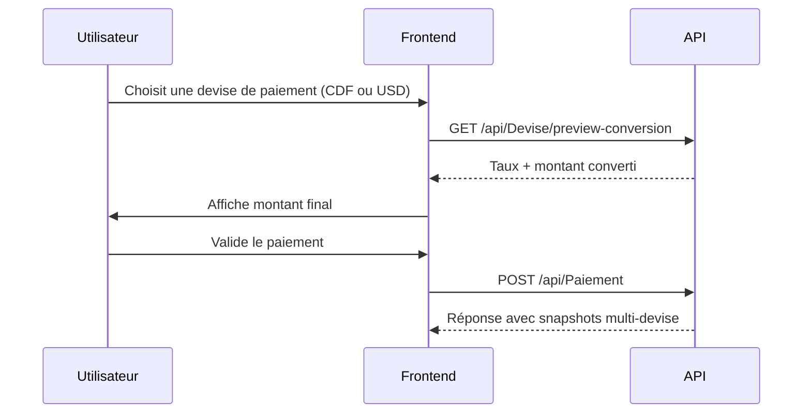

# Guide portable — Implémentation MultiDevise (CongoTravelAPI)

> Document de référence pour réutiliser l’implémentation multi-devise de CongoTravel dans un autre projet backend, mobile ou web.
>
> Basé sur les fichiers de référence déjà présents dans le dépôt : `Controllers/DeviseController.cs`, `Controllers/PaiementController.cs`, `Services/VoyageService.cs`, `Services/FlexPayReservationService.cs`, `Integration-MultiDevise-From-CongoTravelAPI.md` et `Integration-FlexPay-From-CongoTravelAPI.md`.

## 1. Objectif

Ce document décrit une implémentation portable du module multi-devise de CongoTravel avec les règles métier, le modèle de données, l’API, le flux de conversion et les points de validation à respecter pour reproduire le comportement dans un autre projet.

## 2. Résumé exécutif

| Élément | Recommandation |
|--------|-----------------|
| Devise principale | Une devise principale par société (`Societe.CodeDevisePrincipale`) |
| Devise d’origine | La devise saisie par le client ou par le métier (`CodeDevisePaiement`, `CodeDevisePrix`, etc.) |
| Taux de change | Stockés dans `TauxChanges`, avec historique par `DateEffet` |
| Règle d’écriture | Toujours figer le snapshot au moment de l’écriture |
| Conversion | `MontantCible = Round(MontantSource × Taux, 2)` |
| Preview | `GET /api/Devise/preview-conversion` |
| Cas spécial FlexPay | Convertir vers la devise de paiement choisie, puis arrondir si la devise de paiement est `CDF` |

## 3. Règles métier clés

### 3.1 Devise principale par société

- Chaque société possède une devise principale unique.
- Cette devise sert à la consolidation, au reporting et aux agrégats.
- Exemple : `CDF` comme devise principale, avec `USD` comme devise de paiement ou de prix si nécessaire.

### 3.2 Devise d’origine

Les montants métier peuvent être saisis dans une devise différente de la devise principale :

- `Paiement.CodeDevisePaiement`
- `Voyage.CodeDevisePrix`
- `Remboursement.CodeDeviseRemboursement`

### 3.3 Snapshot obligatoire

À l’écriture, il faut enregistrer :

- la devise source
- la devise principale
- le taux appliqué
- le montant déjà converti dans la devise principale

Cela évite toute modification rétroactive si le taux change ensuite.

### 3.4 Taux de change

- Les taux sont saisis manuellement par l’admin ou le gestionnaire.
- Ils doivent être orientés : `Source -> Cible`.
- La règle du plus récent taux valide à la date donnée doit être respectée.
- Si le taux manque pour la paire demandée, il faut renvoyer une erreur métier explicite.

## 4. Modèle de données minimal

### 4.1 Table `Societes`

Ajouter une colonne :

```sql
ALTER TABLE Societes ADD CodeDevisePrincipale VARCHAR(3) NULL;
```

### 4.2 Table `DevisesMonetaires`

```sql
CREATE TABLE DevisesMonetaires (
    IdDeviseMonetaire INT PRIMARY KEY IDENTITY,
    IdSociete INT NOT NULL,
    CodeDevise VARCHAR(3) NOT NULL,
    Libelle VARCHAR(120) NOT NULL,
    Symbole VARCHAR(10) NULL,
    Statut BIT NOT NULL DEFAULT 1,
    DateCreation DATETIME NOT NULL DEFAULT GETUTCDATE()
);
```

Contrainte recommandée :

```sql
CREATE UNIQUE INDEX UX_DevisesMonetaires_Societe_Code
    ON DevisesMonetaires (IdSociete, CodeDevise);
```

### 4.3 Table `TauxChanges`

```sql
CREATE TABLE TauxChanges (
    IdTauxChange INT PRIMARY KEY IDENTITY,
    IdSociete INT NOT NULL,
    CodeDeviseSource VARCHAR(3) NOT NULL,
    CodeDeviseCible VARCHAR(3) NOT NULL,
    Taux DECIMAL(18,8) NOT NULL,
    DateEffet DATETIME NOT NULL,
    Statut BIT NOT NULL DEFAULT 1,
    DateCreation DATETIME NOT NULL DEFAULT GETUTCDATE()
);
```

### 4.4 Extensions des tables métier

#### Paiements

```sql
ALTER TABLE Paiements ADD
    CodeDevisePaiement VARCHAR(3) NULL,
    CodeDevisePrincipale VARCHAR(3) NULL,
    TauxVersDevisePrincipale DECIMAL(18,8) NULL,
    MontantAPayeDevisePrincipale DECIMAL(18,2) NULL,
    MontantPayeDevisePrincipale DECIMAL(18,2) NULL,
    ResteAPayeDevisePrincipale DECIMAL(18,2) NULL,
    DatePaiement DATETIME NULL;
```

#### Voyages

```sql
ALTER TABLE Voyages ADD
    CodeDevisePrix VARCHAR(3) NULL,
    CodeDevisePrincipale VARCHAR(3) NULL,
    TauxVersDevisePrincipale DECIMAL(18,8) NULL,
    PrixDevisePrincipale DECIMAL(18,2) NULL;
```

#### Remboursements

```sql
ALTER TABLE Remboursements ADD
    CodeDeviseRemboursement VARCHAR(3) NULL,
    CodeDevisePrincipale VARCHAR(3) NULL,
    TauxVersDevisePrincipale DECIMAL(18,8) NULL,
    MontantRembourseDevisePrincipale DECIMAL(18,2) NULL,
    DateRemboursement DATETIME NULL;
```

## 5. Algorithme de conversion

### 5.1 Conversion vers la devise principale

```text
Entrée : idSociete, codeDeviseSource, montant, dateReference

1. Récupérer la devise principale de la société.
2. Vérifier que la devise source existe et est active.
3. Si source == devise principale, taux = 1.
4. Sinon, chercher le taux le plus récent :
   source = codeDeviseSource
   cible = codeDevisePrincipale
   dateEffet <= dateReference
   statut = active
5. Si aucun taux n'est trouvé : erreur métier.
6. montantConverti = Round(montant * taux, 2)
7. Enregistrer le snapshot.
```

### 5.2 Conversion entre deux devises arbitraires

Cas pratique : un voyage est en `USD`, mais la devise de paiement choisie est `CDF`.

Pseudo-code :

```text
si source == cible:
    montantCible = montantSource
    taux = 1
sinon:
    tenter conversion directe source -> cible
    si aucun taux direct:
        tenter inverse cible -> source
        taux = 1 / tauxInverse
```

### 5.3 Arrondi spécial FlexPay

Pour les paiements `CDF`, l’arrondi final doit être cohérent avec le prestataire :

```csharp
if (codeDevisePaiement == "CDF")
    montantFlexPay = Math.Round(montantFlexPay, 0, MidpointRounding.AwayFromZero);
```

## 6. Interface de service recommandée

```csharp
public interface ICurrencyConversionService
{
    Task<ConversionResult> ConvertToPrincipalAsync(
        int idSociete,
        string codeDeviseSource,
        decimal montant,
        DateTime dateReference,
        CancellationToken ct = default);

    Task<ConversionResult> ConvertAsync(
        int idSociete,
        string codeSource,
        string codeCible,
        decimal montant,
        DateTime dateReference,
        CancellationToken ct = default);
}
```

```csharp
public record ConversionResult(
    bool Success,
    string? ErrorMessage,
    string CodeDeviseSource,
    string CodeDeviseCible,
    decimal Taux,
    decimal MontantSource,
    decimal MontantCible);
```

## 7. API à exposer

### 7.1 Endpoint de preview

```http
GET /api/Devise/preview-conversion?idSociete=1&codeDeviseSource=USD&montant=25&datePaiement=2026-05-08T10:30:00Z
```

Réponse attendue :

```json
{
  "idSociete": 1,
  "codeDeviseSource": "USD",
  "codeDevisePrincipale": "CDF",
  "datePaiement": "2026-05-08T10:30:00Z",
  "taux": 2850.5,
  "montantSource": 25,
  "montantConverti": 71262.5
}
```

### 7.2 Endpoints de référence

| Méthode | Route | Description |
|--------|-------|-------------|
| GET | `/api/Devise/devises` | Liste des devises actives |
| POST | `/api/Devise/devises` | Créer une devise |
| POST | `/api/Devise/taux-change` | Créer un taux |
| GET | `/api/Devise/preview-conversion` | Simuler une conversion |

## 8. Intégration par use case

### 8.1 Paiement

Flux conseillé :

1. Recevoir le montant et la devise de paiement.
2. Appeler le service de conversion avec la date métier.
3. Stocker le snapshot dans la ligne de paiement.
4. Recalculer les montants restants dans la devise principale.

### 8.2 Voyage

Flux conseillé :

1. Récupérer `Prix` et `CodeDevisePrix`.
2. Convertir vers la devise principale.
3. Stocker `PrixDevisePrincipale` et `TauxVersDevisePrincipale`.
4. Reprendre ce snapshot pour les rapports et les remboursements.

### 8.3 Remboursement

Même logique que pour le paiement :

- utiliser la date de remboursement pour le taux
- calculer le montant remboursé dans la devise principale
- conserver les snapshots historiques

## 9. Flux frontend recommandé



## 10. Points d’implémentation à respecter

- Ne jamais recalculer les historiques quand le taux change.
- Toujours garder la devise source et la devise principale au même moment.
- Utiliser une seule source de vérité pour le taux actif par société et par paire.
- Exposer un endpoint de preview avant validation.
- Gérer l’absence de taux avec une erreur métier claire.
- En cas de FlexPay, faire le calcul côté serveur et ne pas se fier au client.

## 11. Checklist de validation

- [ ] Ajout du champ `CodeDevisePrincipale` sur la société
- [ ] Création des tables `DevisesMonetaires` et `TauxChanges`
- [ ] Extension des tables métier avec colonnes snapshot
- [ ] Implémentation du service de conversion
- [ ] Exposition du preview endpoint
- [ ] Règle de taux manquant en erreur 400/422
- [ ] Tests : même devise, USD→CDF, CDF→USD, taux absent
- [ ] Vérification du reporting consolidé en devise principale
- [ ] Validation FlexPay si le cas est activé

## 12. Références dans le dépôt

### Fichiers utiles

- `Controllers/DeviseController.cs`
- `Controllers/PaiementController.cs`
- `Services/VoyageService.cs`
- `Services/FlexPayReservationService.cs`
- `Integration-MultiDevise-From-CongoTravelAPI.md`
- `Integration-FlexPay-From-CongoTravelAPI.md`
- `Documentation/Themes/06_facturation_paiement/DOCUMENTATION_MODULE_MULTIDEVISE.md`
- `TESTS_MULTIDEVISE_PHASES_1_2_3.http`

### Scripts SQL associés

- `deploy_multidevise_phase1.sql`
- `deploy_multidevise_phase23.sql`
- `deploy_multidevise_full.sql`

## 13. Erreurs fréquentes à éviter

1. Stocker uniquement la devise principale et perdre l’audit.
2. Recalculer les montants historiques après un changement de taux.
3. Oublier l’arrondi spécifique pour `CDF`.
4. Faire confiance au montant envoyé par le client.
5. Ne pas exposer de preview avant validation.

## 14. Conclusion

La clé du module multi-devise CongoTravel est simple : conserver la devise source, enregistrer la devise principale, appliquer le bon taux à la date de l’opération, puis figer les montants convertis dans le snapshot. C’est cette discipline qui permet de rendre l’implémentation portable et fiable dans un autre projet.

---

*Document généré pour servir de guide portable d’implémentation multi-devise basé sur l’implémentation CongoTravelAPI.*
