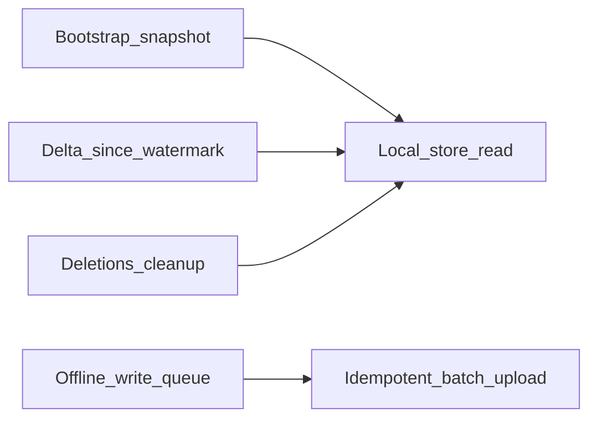

# Intégration portable — Mode Offline / Sync

Guide **réutilisable hors métier énergie** : architecture, contrat HTTP et responsabilités client pour prendre en charge un mode hors ligne (lecture locale + file d’écritures idempotentes).

- Auth : `Authorization: Bearer {jwt}`
- JSON : **camelCase**
- Organisation / tenant : dérivée du JWT (`idSociete`) — pas de paramètre query obligatoire sur la plupart des routes
- Ce document décrit le **noyau portable**. Le mapping métier facture / client / arriéré est en **Annexe A**.

Références historiques (non portables, parfois exemples obsolètes) :

- [`DOCUMENTATION_ENDPOINTS_SYNC.md`](../DOCUMENTATION_ENDPOINTS_SYNC.md)
- [`docs/FRONTEND_INTEGRATION_MULTIDEVISE_FLEXPAY.md`](./FRONTEND_INTEGRATION_MULTIDEVISE_FLEXPAY.md) (section offline CASH vs FlexPay)

**Source de vérité** : DTOs sous `Models/DTOs/Sync/` et `Controllers/SyncController.cs`.

---

## 1. Architecture portable



| Pattern | Rôle |
|---------|------|
| **Bootstrap** | Snapshot initial + watermark pour démarrer |
| **Delta** | Modifications depuis `since` (watermark) |
| **Cursor** | Pagination opaque des gros volumes |
| **File d’écritures** | Créations locales hors ligne |
| **Batch idempotent** | Upload avec `clientRequestId` (UUID) unique |
| **Deletions** | Purge soft-delete / désactivations du cache local |

### Invariants (à conserver partout)

| Règle | Conséquence |
|-------|-------------|
| Fiches métier syncées = **read-only** offline | Pas de CRUD offline des entités lecture |
| Seule la file d’écritures est créée hors ligne | Encaissements / transactions CASH-like |
| Chaque écriture a un `clientRequestId` stable | Idempotence (rejeu réseau sans double effet) |
| Watermark persisté localement | Delta fiable au reconnect |
| Flux réseau temps réel exclus de la file | Ex. paiement électronique async / 3-D Secure |

---

## 2. Vocabulaire découplé

| Concept portable | Équivalent API actuelle |
|------------------|-------------------------|
| Organisation / tenant | `idSociete` (JWT) |
| Fiches métier (lecture) | `GET /api/sync/clients` |
| Postes à encaisser / soldes | `GET /api/sync/arrears` |
| Écritures offline | `POST /api/sync/payments/batch` |
| Watermark | `watermark` / `since` / `nextSince` |
| Snapshot de session | `snapshot` (cohérence pendant une sync) |
| Pagination | `cursor` / `nextCursor` / `hasMore` / `pageSize` |

---

## 3. Concepts techniques

### Watermark

Chaîne opaque fournie par le serveur. Persister après bootstrap et après chaque page / deletions réussie. Repasser en `since` pour le delta.

### Cursor

Token opaque (souvent Base64 signé). Boucler tant que `hasMore === true` en passant `nextCursor`.

### Snapshot

Token de cohérence de session de sync (query optionnelle `snapshot` sur les endpoints paginés / deletions). Conserver celui renvoyé dans la page courante pour les requêtes suivantes de la même session.

### Idempotence

Chaque item du batch porte un `clientRequestId` (UUID, max 36 caractères). Un rejeu avec le même id → statut `duplicate` (pas de second enregistrement).

### Limites (DTO actuel)

| Paramètre | Défaut | Max |
|-----------|--------|-----|
| `pageSize` | `1000` | `5000` |

---

## 4. Contrat HTTP — `/api/sync`

Tous les endpoints : `[Authorize]`.

| Méthode | Route | Rôle portable |
|---------|-------|---------------|
| `GET` | `/api/sync/bootstrap` | Snapshot initial + watermark |
| `GET` | `/api/sync/clients` | Delta / pages fiches lecture |
| `GET` | `/api/sync/arrears` | Delta / pages soldes |
| `GET` | `/api/sync/deletions` | Purge soft-delete / désactivations |
| `POST` | `/api/sync/payments/batch` | Upload écritures + résultats par `clientRequestId` |

### 4.1 Bootstrap

```http
GET /api/sync/bootstrap
```

Réponse (`SyncBootstrapDto`) :

```json
{
  "watermark": "2024-03-21T10:30:00.000Z_12345",
  "clients": [ /* ClientSyncDto */ ],
  "arrears": [ /* ArrearSyncDto */ ]
}
```

Cas d’usage : première install, reset local, sync forcée après longue inactivité.

### 4.2 Fiches (clients) — page + delta

```http
GET /api/sync/clients?since={watermark}&cursor={cursor}&pageSize=1000&snapshot={snapshot}
```

Query (`SyncRequestDto`) : `cursor`, `pageSize`, `snapshot`, `since` — tous optionnels.

Réponse (`SyncPageDto<ClientSyncDto>`) :

```json
{
  "snapshot": "...",
  "items": [
    {
      "idClient": 1,
      "nomClient": "Jean Dupont",
      "adresseClient": "…",
      "telephone": "…",
      "emailClient": null,
      "codeCons": "b/b4/0003",
      "idSociete": 1,
      "isActif": true,
      "statut": true,
      "isDeleted": false,
      "updatedAt": "2024-03-21T10:30:00.000Z",
      "clientUsages": []
    }
  ],
  "nextCursor": "…",
  "hasMore": true,
  "nextSince": "2024-03-21T10:30:00.000Z_12345"
}
```

Champs géographie / usage (`idAxe`, `idCabine`, `idTypeDeCourant`, `clientUsages`, …) = **extensions métier** : ignorer si hors scope du projet cible.

### 4.3 Soldes (arrears) — page + delta

```http
GET /api/sync/arrears?since={watermark}&cursor={cursor}&pageSize=1000&onlyOutstanding=true
```

Query supplémentaire (`SyncArrearsRequestDto`) : `onlyOutstanding` (défaut **`true`**).

Réponse (`SyncPageDto<ArrearSyncDto>`) — item type :

```json
{
  "idClientFacture": 1,
  "idFacture": 1,
  "idClient": 1,
  "numeroFacture": "F2024-001",
  "dateEmission": "2024-03-01T00:00:00.000Z",
  "mois": "03",
  "annees": 2024,
  "montantTotal": 15000,
  "montantPaye": 5000,
  "montantDu": 10000,
  "libelleUsage": "Résidentiel",
  "estArrierePreExistant": false,
  "dateModification": "2024-03-21T10:30:00.000Z"
}
```

Dans un métier non-facturation : mapper mentalement vers « poste à encaisser » (`montantDu`, lien vers fiche `idClient`, id de poste `idClientFacture`).

### 4.4 Deletions — purge cache

```http
GET /api/sync/deletions?since={watermark}&snapshot={snapshot}
```

`since` est **obligatoire** (`SyncDeletionsRequestDto`).

Réponse (`SyncDeletionsDto`) :

```json
{
  "snapshot": "…",
  "deletedClientIds": [123],
  "deactivatedClientIds": [45],
  "removedClientFactureIds": [678],
  "deletedPaymentIds": [],
  "nextSince": "2024-03-21T10:30:00.000Z_12345"
}
```

Actions locales :

- Retirer du store les IDs de `deletedClientIds` / `deactivatedClientIds`
- Retirer les postes de `removedClientFactureIds`
- Optionnel : purger `deletedPaymentIds`

### 4.5 Batch d’écritures (paiements)

```http
POST /api/sync/payments/batch
Content-Type: application/json
```

Corps (`PaymentBatchRequestDto`) — propriété **`items`** (pas `payments`) :

```json
{
  "items": [
    {
      "clientRequestId": "550e8400-e29b-41d4-a716-446655440000",
      "idClient": 1,
      "idClientFacture": 1,
      "idFacture": 1,
      "montantPaye": 5000,
      "datePaiementUtc": "2024-03-21T10:30:00.000Z",
      "methodePaiement": "Espèces",
      "referenceTransaction": null,
      "commentaire": "Encaissement offline",
      "deviceId": "device-abc",
      "codeDevisePaiement": "CDF"
    }
  ]
}
```

| Champ | Obligatoire | Notes |
|-------|-------------|-------|
| `clientRequestId` | oui | UUID stable, max 36 |
| `idClient` | oui | Fiche liée |
| `montantPaye` | oui | > 0 |
| `datePaiementUtc` | oui | UTC |
| `methodePaiement` | oui | CASH-like (Espèces, virement, chèque…) |
| `idClientFacture` / `idFacture` | selon métier | Ciblage du poste |
| `codeDevisePaiement` | non | Aligné devise du poste si multi-devise |
| `deviceId` | non | Traçabilité appareil |

Réponse (`PaymentBatchResultDto`) :

```json
{
  "results": [
    {
      "clientRequestId": "550e8400-e29b-41d4-a716-446655440000",
      "status": "created",
      "idPaiement": 456,
      "newMontantDu": 5000,
      "message": "…",
      "errorCode": null
    }
  ],
  "summary": {
    "total": 1,
    "created": 1,
    "duplicates": 0,
    "rejected": 0,
    "errors": 0
  }
}
```

| `status` | Action file locale |
|----------|-------------------|
| `created` | Succès — retirer de la file |
| `duplicate` | Déjà traité — retirer (idempotence OK) |
| `rejected` | Rejet métier — sortir de la file + UX erreur (`errorCode` / `message`) |
| `error` | Erreur technique — **garder** et retry plus tard |

---

## 5. Cycle client recommandé

1. **Cold start** : `GET /bootstrap` → persister `clients`, `arrears`, `watermark`
2. **Online périodique** : pages `clients` + `arrears` avec `since` / `cursor` → mettre à jour le store → mémoriser `nextSince`
3. **Purge** : `GET /deletions?since=…` → appliquer les listes d’IDs
4. **Offline** : créer des écritures en file locale avec UUID figé à la création
5. **Reconnect** : `POST /payments/batch` → traiter chaque `status` (tableau ci-dessus)
6. **Après upload** : re-sync `arrears` (et éventuellement `clients`) pour rafraîchir les soldes

Responsabilités client (sans imposer SQLite / Hive / Drift) :

- Store local des fiches + soldes
- File d’écritures persistante (survit au kill app)
- Indicateur online/offline + déclencheur de sync
- Ne jamais régénérer un `clientRequestId` pour la même écriture

---

## 6. Erreurs fréquentes

| HTTP / cas | Cause | UI / client |
|------------|-------|-------------|
| 401 | JWT absent / expiré | Re-login avant sync |
| 500 | Erreur serveur | Retry avec backoff ; ne pas vider la file |
| Batch `rejected` | Validation métier | Afficher `message` / `errorCode` ; ne pas boucler à l’infini |
| Batch `duplicate` | Rejeu du même UUID | Traiter comme succès idempotent |
| `deletions` sans `since` | Paramètre requis | Toujours envoyer le watermark local |
| Double écriture sans UUID stable | Bug client | Garantir UUID à la création locale |

Corps d’erreur serveur typique : `{ "message": "…" }`.

---

## 7. Checklist d’intégration (neutre)

- [ ] JWT sur toutes les routes `/api/sync/*`
- [ ] Bootstrap au premier lancement ; watermark persisté
- [ ] Delta via `since` + pagination via `cursor` / `hasMore`
- [ ] Fiches = lecture seule offline
- [ ] File d’écritures avec `clientRequestId` UUID unique et stable
- [ ] Upload via `items` (pas `payments`)
- [ ] Traitement des 4 `status` : `created` / `duplicate` / `rejected` / `error`
- [ ] Purge via `deletions` (`deleted*` / `deactivated*` / `removed*`)
- [ ] Flux réseau temps réel **exclus** de la file offline
- [ ] Re-sync soldes après batch réussi
- [ ] États loading / empty / error / « en attente de sync »

---

## Annexe A — Mapping Kenergie (non portable)

| Portable | Kenergie |
|----------|----------|
| Fiche | `Client` (`ClientSyncDto`) |
| Poste à encaisser | `ClientFacture` / arriéré (`ArrearSyncDto`) |
| Écriture | `Paiement` (batch sync) |
| Organisation | Société JWT |

Règles métier Kenergie :

- Clients **non créés / modifiés** offline (read-only)
- Seuls les paiements **CASH-like** (espèces, virement, chèque…) dans la file
- **Ne pas** mettre FlexPay / Mobile Money async en file offline (réseau obligatoire) — voir [`FRONTEND_INTEGRATION_MULTIDEVISE_FLEXPAY.md`](./FRONTEND_INTEGRATION_MULTIDEVISE_FLEXPAY.md) § offline
- Multi-devise : `codeDevisePaiement` aligné sur la devise du poste

Docs détaillées métier :

- [`DOCUMENTATION_ENDPOINTS_SYNC.md`](../DOCUMENTATION_ENDPOINTS_SYNC.md)
- [`EXEMPLES_UTILISATION_SYNC.md`](../EXEMPLES_UTILISATION_SYNC.md)

---

## Annexe B — Clients HTTP minimaux

### TypeScript

```ts
export const syncApi = {
  bootstrap: () => api.get('/api/sync/bootstrap'),
  clients: (params?: {
    since?: string
    cursor?: string
    pageSize?: number
    snapshot?: string
  }) => api.get('/api/sync/clients', { params }),
  arrears: (params?: {
    since?: string
    cursor?: string
    pageSize?: number
    snapshot?: string
    onlyOutstanding?: boolean
  }) => api.get('/api/sync/arrears', { params }),
  deletions: (params: { since: string; snapshot?: string }) =>
    api.get('/api/sync/deletions', { params }),
  paymentsBatch: (body: { items: Record<string, unknown>[] }) =>
    api.post('/api/sync/payments/batch', body),
}
```

### Dart (Dio)

```dart
class SyncApi {
  SyncApi(this._dio);
  final Dio _dio;

  Future<Map<String, dynamic>> bootstrap() async {
    final r = await _dio.get('/api/sync/bootstrap');
    return r.data as Map<String, dynamic>;
  }

  Future<Map<String, dynamic>> clients({
    String? since,
    String? cursor,
    int? pageSize,
    String? snapshot,
  }) async {
    final r = await _dio.get('/api/sync/clients', queryParameters: {
      if (since != null) 'since': since,
      if (cursor != null) 'cursor': cursor,
      if (pageSize != null) 'pageSize': pageSize,
      if (snapshot != null) 'snapshot': snapshot,
    });
    return r.data as Map<String, dynamic>;
  }

  Future<Map<String, dynamic>> arrears({
    String? since,
    String? cursor,
    int? pageSize,
    String? snapshot,
    bool onlyOutstanding = true,
  }) async {
    final r = await _dio.get('/api/sync/arrears', queryParameters: {
      if (since != null) 'since': since,
      if (cursor != null) 'cursor': cursor,
      if (pageSize != null) 'pageSize': pageSize,
      if (snapshot != null) 'snapshot': snapshot,
      'onlyOutstanding': onlyOutstanding,
    });
    return r.data as Map<String, dynamic>;
  }

  Future<Map<String, dynamic>> deletions({
    required String since,
    String? snapshot,
  }) async {
    final r = await _dio.get('/api/sync/deletions', queryParameters: {
      'since': since,
      if (snapshot != null) 'snapshot': snapshot,
    });
    return r.data as Map<String, dynamic>;
  }

  Future<Map<String, dynamic>> paymentsBatch(List<Map<String, dynamic>> items) async {
    final r = await _dio.post('/api/sync/payments/batch', data: {'items': items});
    return r.data as Map<String, dynamic>;
  }
}
```
